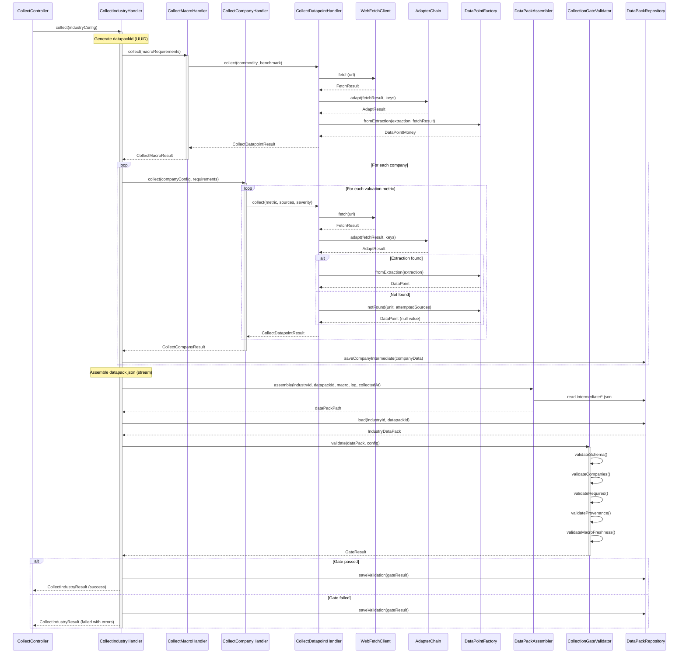

# Phase 1: Collection — Technical Design Document

**Project:** Aimm (Equity Intelligence Pipeline)
**Phase:** 1 — Collection
**Version:** 1.0
**Status:** Draft

---

## Table of Contents

1. [Overview](#1-overview)
2. [DTO & Value Object Layer](#2-dto--value-object-layer)
3. [The Collection Engine](#3-the-collection-engine)
4. [Orchestration Handlers](#4-orchestration-handlers)
5. [The Collection Gate](#5-the-collection-gate)
6. [Storage Strategy](#6-storage-strategy)
7. [Visual Flow](#7-visual-flow)
8. [Error Handling Strategy](#8-error-handling-strategy)
9. [Testing Strategy](#9-testing-strategy)
10. [Implementation Plan](#10-implementation-plan)

---

## 1. Overview

Phase 1 transforms an industry configuration file into a validated `IndustryDataPack`. The system collects financial data for all configured companies, macro indicators, and passes through a validation gate before persisting to disk.

### Core Principle

> **Data quality over speed.** Every datapoint must carry method-specific provenance: `web_fetch/api/web_search` require `source_url + retrieved_at + source_locator`; `not_found` requires `attempted_sources + retrieved_at`; `derived` requires `derived_from + formula + retrieved_at`.

### Input/Output

| Item | Description |
|------|-------------|
| **Input** | `config/industries/{industry_id}.json` |
| **Output** | `runtime/datapacks/{industry_id}/{uuid}/datapack.json` |
| **Gate** | `CollectionGateValidator` — blocks pipeline on failure |

### Technology Stack

- PHP 8.2+, Yii 2 Framework
- `opis/json-schema` for JSON Schema validation (draft-07)
- `guzzlehttp/guzzle` for HTTP client
- `ramsey/uuid` for datapack identifiers

---

## 2. DTO & Value Object Layer

### 2.1 IndustryDataPack

The primary output of Phase 1. Contains all collected data for an industry.

**Namespace:** `app\dto`

```php
namespace app\dto;

use DateTimeImmutable;

final readonly class IndustryDataPack
{
    /**
     * @param array<string, CompanyData> $companies Indexed by ticker
     */
    public function __construct(
        public string $industryId,
        public string $datapackId,
        public DateTimeImmutable $collectedAt,
        public MacroData $macro,
        public array $companies,
        public CollectionLog $collectionLog,
    ) {}

    public function toArray(): array
    {
        return [
            'industry_id' => $this->industryId,
            'datapack_id' => $this->datapackId,
            'collected_at' => $this->collectedAt->format(DateTimeImmutable::ATOM),
            'macro' => $this->macro->toArray(),
            'companies' => array_map(
                fn(CompanyData $c) => $c->toArray(),
                $this->companies
            ),
            'collection_log' => $this->collectionLog->toArray(),
        ];
    }
}
```

**Responsibilities:**
- Holds complete collection output for one industry
- Serializes to JSON for persistence
- Immutable after construction

### 2.2 CompanyData

**Namespace:** `app\dto`

```php
namespace app\dto;

final readonly class CompanyData
{
    public function __construct(
        public string $ticker,
        public string $name,
        public string $listingExchange,
        public string $listingCurrency,
        public string $reportingCurrency,
        public ValuationData $valuation,
        public FinancialsData $financials,
        public QuartersData $quarters,
        public ?OperationalData $operational = null,
    ) {}

    public function toArray(): array
    {
        return [
            'ticker' => $this->ticker,
            'name' => $this->name,
            'listing_exchange' => $this->listingExchange,
            'listing_currency' => $this->listingCurrency,
            'reporting_currency' => $this->reportingCurrency,
            'valuation' => $this->valuation->toArray(),
            'financials' => $this->financials->toArray(),
            'quarters' => $this->quarters->toArray(),
            'operational' => $this->operational?->toArray(),
        ];
    }
}
```

### 2.3 ValuationData

**Namespace:** `app\dto`

```php
namespace app\dto;

use app\dto\datapoints\DataPointMoney;
use app\dto\datapoints\DataPointRatio;
use app\dto\datapoints\DataPointPercent;

final readonly class ValuationData
{
    public function __construct(
        public DataPointMoney $marketCap,
        public ?DataPointRatio $fwdPe = null,
        public ?DataPointRatio $trailingPe = null,
        public ?DataPointRatio $evEbitda = null,
        public ?DataPointMoney $freeCashFlowTtm = null,
        public ?DataPointPercent $fcfYield = null,
        public ?DataPointPercent $divYield = null,
        public ?DataPointRatio $netDebtEbitda = null,
        public ?DataPointRatio $priceToBook = null,
    ) {}

    public function toArray(): array
    {
        return [
            'market_cap' => $this->marketCap->toArray(),
            'fwd_pe' => $this->fwdPe?->toArray(),
            'trailing_pe' => $this->trailingPe?->toArray(),
            'ev_ebitda' => $this->evEbitda?->toArray(),
            'free_cash_flow_ttm' => $this->freeCashFlowTtm?->toArray(),
            'fcf_yield' => $this->fcfYield?->toArray(),
            'div_yield' => $this->divYield?->toArray(),
            'net_debt_ebitda' => $this->netDebtEbitda?->toArray(),
            'price_to_book' => $this->priceToBook?->toArray(),
        ];
    }
}
```

### 2.4 MacroData

**Namespace:** `app\dto`

```php
namespace app\dto;

use app\dto\datapoints\DataPointMoney;
use app\dto\datapoints\DataPointNumber;

final readonly class MacroData
{
    public function __construct(
        public ?DataPointMoney $commodityBenchmark = null,
        public ?DataPointMoney $marginProxy = null,
        public ?DataPointNumber $sectorIndex = null,
        public array $additionalIndicators = [],
    ) {}

    public function toArray(): array
    {
        return [
            'commodity_benchmark' => $this->commodityBenchmark?->toArray(),
            'margin_proxy' => $this->marginProxy?->toArray(),
            'sector_index' => $this->sectorIndex?->toArray(),
            'additional_indicators' => array_map(
                fn($dp) => $dp->toArray(),
                $this->additionalIndicators
            ),
        ];
    }
}
```

### 2.5 Typed DataPoint Value Objects

All datapoints follow a common structure but with type-specific semantics.

#### 2.5.1 DataPointMoney

For monetary values (market cap, revenue, prices).

**Namespace:** `app\dto\datapoints`

```php
namespace app\dto\datapoints;

use DateTimeImmutable;
use app\enums\CollectionMethod;

final readonly class DataPointMoney
{
    public const UNIT = 'currency';

    public function __construct(
        public ?float $value,
        public string $currency,
        public string $scale,
        public DateTimeImmutable $asOf,
        public ?string $sourceUrl,
        public DateTimeImmutable $retrievedAt,
        public CollectionMethod $method,
        public ?SourceLocator $sourceLocator = null,
        public ?array $attemptedSources = null,
        public ?array $derivedFrom = null,
        public ?string $formula = null,
        public ?FxConversion $fxConversion = null,
    ) {}

    /**
     * Get value in base units (not millions/billions)
     */
    public function getBaseValue(): ?float
    {
        if ($this->value === null) {
            return null;
        }

        return match ($this->scale) {
            'units' => $this->value,
            'thousands' => $this->value * 1_000,
            'millions' => $this->value * 1_000_000,
            'billions' => $this->value * 1_000_000_000,
            'trillions' => $this->value * 1_000_000_000_000,
            default => $this->value,
        };
    }

    public function toArray(): array
    {
        return [
            'value' => $this->value,
            'unit' => self::UNIT,
            'currency' => $this->currency,
            'scale' => $this->scale,
            'as_of' => $this->asOf->format('Y-m-d'),
            'source_url' => $this->sourceUrl,
            'retrieved_at' => $this->retrievedAt->format(DateTimeImmutable::ATOM),
            'method' => $this->method->value,
            'source_locator' => $this->sourceLocator?->toArray(),
            'attempted_sources' => $this->attemptedSources,
            'derived_from' => $this->derivedFrom,
            'formula' => $this->formula,
            'fx_conversion' => $this->fxConversion?->toArray(),
        ];
    }
}
```

**Responsibilities:**
- Stores monetary values with currency and scale
- Provides base value conversion
- Tracks FX conversion if currency was converted

#### 2.5.2 DataPointRatio

For dimensionless ratios (P/E, EV/EBITDA).

**Namespace:** `app\dto\datapoints`

```php
namespace app\dto\datapoints;

use DateTimeImmutable;
use app\enums\CollectionMethod;

final readonly class DataPointRatio
{
    public const UNIT = 'ratio';

    public function __construct(
        public ?float $value,
        public DateTimeImmutable $asOf,
        public ?string $sourceUrl,
        public DateTimeImmutable $retrievedAt,
        public CollectionMethod $method,
        public ?SourceLocator $sourceLocator = null,
        public ?array $attemptedSources = null,
        public ?array $derivedFrom = null,
        public ?string $formula = null,
    ) {}

    public function toArray(): array
    {
        return [
            'value' => $this->value,
            'unit' => self::UNIT,
            'as_of' => $this->asOf->format('Y-m-d'),
            'source_url' => $this->sourceUrl,
            'retrieved_at' => $this->retrievedAt->format(DateTimeImmutable::ATOM),
            'method' => $this->method->value,
            'source_locator' => $this->sourceLocator?->toArray(),
            'attempted_sources' => $this->attemptedSources,
            'derived_from' => $this->derivedFrom,
            'formula' => $this->formula,
        ];
    }
}
```

**Responsibilities:**
- Stores dimensionless ratio values (e.g., 12.5 for 12.5x)
- Supports derived datapoints with formula tracking
- Immutable value object

#### 2.5.3 DataPointPercent

For percentage values (yields, margins).

**Namespace:** `app\dto\datapoints`

```php
namespace app\dto\datapoints;

use DateTimeImmutable;
use app\enums\CollectionMethod;

final readonly class DataPointPercent
{
    public const UNIT = 'percent';

    public function __construct(
        public ?float $value,
        public DateTimeImmutable $asOf,
        public ?string $sourceUrl,
        public DateTimeImmutable $retrievedAt,
        public CollectionMethod $method,
        public ?SourceLocator $sourceLocator = null,
        public ?array $attemptedSources = null,
        public ?array $derivedFrom = null,
        public ?string $formula = null,
    ) {}

    /**
     * Get value as decimal (e.g., 0.045 for 4.5%)
     */
    public function getDecimalValue(): ?float
    {
        if ($this->value === null) {
            return null;
        }
        return $this->value / 100;
    }

    public function toArray(): array
    {
        return [
            'value' => $this->value,
            'unit' => self::UNIT,
            'as_of' => $this->asOf->format('Y-m-d'),
            'source_url' => $this->sourceUrl,
            'retrieved_at' => $this->retrievedAt->format(DateTimeImmutable::ATOM),
            'method' => $this->method->value,
            'source_locator' => $this->sourceLocator?->toArray(),
            'attempted_sources' => $this->attemptedSources,
            'derived_from' => $this->derivedFrom,
            'formula' => $this->formula,
        ];
    }
}
```

**Responsibilities:**
- Stores percentage values (4.5 for 4.5%, not 0.045)
- Provides decimal conversion helper
- Full provenance tracking

#### 2.5.4 SourceLocator

**Namespace:** `app\dto\datapoints`

```php
namespace app\dto\datapoints;

final readonly class SourceLocator
{
    public function __construct(
        public string $type,
        public string $selector,
        public string $snippet,
    ) {}

    public function toArray(): array
    {
        return [
            'type' => $this->type,
            'selector' => $this->selector,
            'snippet' => $this->snippet,
        ];
    }

    public static function html(string $selector, string $snippet): self
    {
        return new self('html', $selector, self::truncateSnippet($snippet));
    }

    public static function json(string $jsonPath, string $snippet): self
    {
        return new self('json', $jsonPath, self::truncateSnippet($snippet));
    }

    public static function xpath(string $xpath, string $snippet): self
    {
        return new self('xpath', $xpath, self::truncateSnippet($snippet));
    }

    private static function truncateSnippet(string $snippet): string
    {
        if (mb_strlen($snippet) <= 100) {
            return $snippet;
        }
        return mb_substr($snippet, 0, 97) . '...';
    }
}
```

**Responsibilities:**
- Records exact location of extracted data
- Truncates snippets to 100 characters
- Factory methods for common locator types

#### 2.5.5 FxConversion

**Namespace:** `app\dto\datapoints`

```php
namespace app\dto\datapoints;

use DateTimeImmutable;

final readonly class FxConversion
{
    public function __construct(
        public string $originalCurrency,
        public float $originalValue,
        public float $rate,
        public DateTimeImmutable $rateAsOf,
        public string $rateSource,
    ) {}

    public function toArray(): array
    {
        return [
            'original_currency' => $this->originalCurrency,
            'original_value' => $this->originalValue,
            'rate' => $this->rate,
            'rate_as_of' => $this->rateAsOf->format('Y-m-d'),
            'rate_source' => $this->rateSource,
        ];
    }
}
```

---

## 3. The Collection Engine

### 3.1 WebFetchClient

Abstraction over HTTP client for fetching web pages.

**Namespace:** `app\clients`

#### Interface

```php
namespace app\clients;

use app\dto\FetchResult;

interface WebFetchClientInterface
{
    /**
     * Fetch content from URL
     *
     * @throws NetworkException On connection failure
     * @throws RateLimitException When rate limited by source
     * @throws BlockedException When blocked by source (e.g., 401/403)
     */
    public function fetch(FetchRequest $request): FetchResult;

    /**
     * Check if domain is currently rate limited
     */
    public function isRateLimited(string $domain): bool;
}
```

#### FetchRequest DTO

```php
namespace app\clients;

final readonly class FetchRequest
{
    public function __construct(
        public string $url,
        public array $headers = [],
        public int $timeoutSeconds = 30,
        public bool $followRedirects = true,
        public ?string $userAgent = null,
    ) {}
}
```

#### FetchResult DTO

```php
namespace app\dto;

use DateTimeImmutable;

final readonly class FetchResult
{
    public function __construct(
        public string $content,
        public string $contentType,
        public int $statusCode,
        public string $url,
        public string $finalUrl,
        public DateTimeImmutable $retrievedAt,
        public array $headers = [],
    ) {}

    public function isHtml(): bool
    {
        return str_contains($this->contentType, 'text/html');
    }

    public function isJson(): bool
    {
        return str_contains($this->contentType, 'application/json');
    }

    public function wasRedirected(): bool
    {
        return $this->url !== $this->finalUrl;
    }
}
```

#### Implementation

```php
namespace app\clients;

use GuzzleHttp\Client;
use GuzzleHttp\Exception\RequestException;
use GuzzleHttp\Exception\ConnectException;
use GuzzleHttp\TransferStats;
use app\alerts\AlertDispatcher;
use app\dto\FetchResult;
use app\exceptions\NetworkException;
use app\exceptions\RateLimitException;
use app\exceptions\BlockedException;
use app\clients\BlockDetectorInterface;
use DateTimeImmutable;
use yii\log\Logger;

final class GuzzleWebFetchClient implements WebFetchClientInterface
{
    /**
     * Exponential backoff durations for 403 responses (in seconds)
     * After 4 consecutive 403s on same domain, use max duration
     */
    private const BLOCK_BACKOFF_SECONDS = [
        0 => 300,      // First 403: 5 minutes
        1 => 900,      // Second 403: 15 minutes
        2 => 3600,     // Third 403: 1 hour
        3 => 21600,    // Fourth+ 403: 6 hours
    ];

    public function __construct(
        private Client $httpClient,
        private RateLimiterInterface $rateLimiter,
        private UserAgentProviderInterface $userAgentProvider,
        private BlockDetectorInterface $blockDetector,
        private AlertDispatcher $alertDispatcher,
        private Logger $logger,
    ) {}

    public function fetch(FetchRequest $request): FetchResult
    {
        $domain = parse_url($request->url, PHP_URL_HOST);
        if (!is_string($domain) || $domain === '') {
            throw new NetworkException(
                "Invalid URL (missing host): {$request->url}",
                $request->url
            );
        }

        if ($this->rateLimiter->isRateLimited($domain)) {
            throw new RateLimitException(
                "Domain {$domain} is rate limited",
                $domain,
                $this->rateLimiter->getRetryTime($domain)
            );
        }

        $attempt = 0;
        $maxAttempts = 3;

        while (true) {
            $this->rateLimiter->wait($domain);
            $effectiveUrl = $request->url;
            $userAgent = $request->userAgent ?? $this->userAgentProvider->getRandom();

            try {
                $response = $this->httpClient->request('GET', $request->url, [
                    'headers' => array_merge(
                        ['User-Agent' => $userAgent],
                        $request->headers
                    ),
                    'timeout' => $request->timeoutSeconds,
                    'connect_timeout' => min(10, $request->timeoutSeconds),
                    'allow_redirects' => $request->followRedirects,
                    'http_errors' => false,
                    'on_stats' => static function (TransferStats $stats) use (&$effectiveUrl): void {
                        $effectiveUrl = (string)$stats->getEffectiveUri();
                    },
                ]);

                $statusCode = $response->getStatusCode();
                $this->rateLimiter->recordRequest($domain);

                if ($statusCode === 429) {
                    $retryUntil = $this->parseRetryAfter($response->getHeaderLine('Retry-After'))
                        ?? new DateTimeImmutable('+60 seconds');

                    $this->rateLimiter->block($domain, $retryUntil);
                    throw new RateLimitException(
                        "Rate limited by {$domain}",
                        $domain,
                        $retryUntil
                    );
                }

                if ($statusCode === 401 || $statusCode === 403) {
                    // Use exponential backoff based on consecutive 403 count
                    $consecutiveBlocks = $this->rateLimiter->getConsecutiveBlockCount($domain);
                    $backoffIndex = min($consecutiveBlocks, count(self::BLOCK_BACKOFF_SECONDS) - 1);
                    $backoffSeconds = self::BLOCK_BACKOFF_SECONDS[$backoffIndex];

                    $retryUntil = new DateTimeImmutable("+{$backoffSeconds} seconds");
                    $this->rateLimiter->recordBlock($domain, $retryUntil);

                    // Notify operators (alerting must not break collection)
                    $this->alertDispatcher->alertBlocked($domain, $effectiveUrl, $retryUntil);

                    throw new BlockedException(
                        "Forbidden by {$domain} (attempt {$consecutiveBlocks}, cooldown {$backoffSeconds}s)",
                        $domain,
                        $effectiveUrl,
                        $retryUntil
                    );
                }

                if ($statusCode >= 500 && $statusCode <= 599 && $attempt < ($maxAttempts - 1)) {
                    $this->backoff($attempt);
                    $attempt++;
                    continue;
                }

                return new FetchResult(
                    content: (string)$response->getBody(),
                    contentType: $response->getHeader('Content-Type')[0] ?? 'text/html',
                    statusCode: $statusCode,
                    url: $request->url,
                    finalUrl: $effectiveUrl,
                    retrievedAt: new DateTimeImmutable(),
                    headers: $response->getHeaders(),
                );
            } catch (ConnectException | RequestException $e) {
                if ($attempt < ($maxAttempts - 1)) {
                    $this->backoff($attempt);
                    $attempt++;
                    continue;
                }

                throw new NetworkException(
                    "Request failed for {$request->url}: {$e->getMessage()}",
                    $request->url,
                    $e
                );
            }
        }
    }

    public function isRateLimited(string $domain): bool
    {
        return $this->rateLimiter->isRateLimited($domain);
    }

    private function backoff(int $attempt): void
    {
        // Exponential backoff: 1s, 2s, 4s
        $baseDelay = pow(2, $attempt);
        // Add +/- 100ms jitter
        $jitter = rand(-100000, 100000) / 1_000_000;
        $delay = max(0.1, $baseDelay + $jitter);
        
        usleep((int)($delay * 1_000_000));
    }

    private function parseRetryAfter(string $headerValue): ?DateTimeImmutable
    {
        if ($headerValue === '') {
            return null;
        }
        if (ctype_digit($headerValue)) {
            return new DateTimeImmutable("+{$headerValue} seconds");
        }

        // Best-effort parse of an HTTP-date (RFC 7231); fall back to null if invalid.
        $date = DateTimeImmutable::createFromFormat(DATE_RFC1123, $headerValue);
        return $date ?: null;
    }
}
```

**Responsibilities:**
- Fetch web pages with configurable timeouts and headers
- Handle rate limiting (HTTP 429) and blocks (HTTP 401/403)
- Retry once on transient network/5xx
- Track redirects
- Integrate with rate limiter

**Method Signatures:**
| Method | Signature |
|--------|-----------|
| `fetch` | `fetch(FetchRequest $request): FetchResult` |
| `isRateLimited` | `isRateLimited(string $domain): bool` |

### 3.1.1 RateLimiterInterface

Manages request pacing and block tracking per domain.

**Namespace:** `app\clients`

```php
namespace app\clients;

use DateTimeImmutable;

interface RateLimiterInterface
{
    /**
     * Check if domain is currently blocked
     */
    public function isRateLimited(string $domain): bool;

    /**
     * Get the time when the domain will be unblocked
     */
    public function getRetryTime(string $domain): ?DateTimeImmutable;

    /**
     * Wait for rate limit window (implements per-domain pacing)
     */
    public function wait(string $domain): void;

    /**
     * Record a successful request (resets consecutive block count)
     */
    public function recordRequest(string $domain): void;

    /**
     * Record a block (401/403) with exponential backoff tracking
     */
    public function recordBlock(string $domain, DateTimeImmutable $retryUntil): void;

    /**
     * Get the number of consecutive blocks for a domain
     */
    public function getConsecutiveBlockCount(string $domain): int;

    /**
     * Block a domain until specified time (for 429 responses)
     */
    public function block(string $domain, DateTimeImmutable $until): void;
}
```

#### FileRateLimiter Implementation

```php
namespace app\clients;

use DateTimeImmutable;

final class FileRateLimiter implements RateLimiterInterface
{
    /**
     * Minimum delay between requests per domain (in milliseconds)
     */
    private const DOMAIN_DELAYS_MS = [
        'finance.yahoo.com' => 2000,  // 2 seconds
        'www.reuters.com' => 3000,    // 3 seconds
        'default' => 1000,            // 1 second fallback
    ];

    private array $lastRequestTime = [];
    private array $blockedUntil = [];
    private array $consecutiveBlocks = [];

    public function __construct(
        private string $storagePath,
    ) {
        $this->loadState();
    }

    public function isRateLimited(string $domain): bool
    {
        if (!isset($this->blockedUntil[$domain])) {
            return false;
        }

        if ($this->blockedUntil[$domain] <= new DateTimeImmutable()) {
            unset($this->blockedUntil[$domain]);
            $this->saveState();
            return false;
        }

        return true;
    }

    public function getRetryTime(string $domain): ?DateTimeImmutable
    {
        return $this->blockedUntil[$domain] ?? null;
    }

    public function wait(string $domain): void
    {
        $delayMs = self::DOMAIN_DELAYS_MS[$domain] ?? self::DOMAIN_DELAYS_MS['default'];
        $lastTime = $this->lastRequestTime[$domain] ?? 0;
        $now = microtime(true) * 1000;
        $elapsed = $now - $lastTime;

        if ($elapsed < $delayMs) {
            usleep((int)(($delayMs - $elapsed) * 1000));
        }
    }

    public function recordRequest(string $domain): void
    {
        $this->lastRequestTime[$domain] = microtime(true) * 1000;

        // Reset consecutive block count on successful request
        if (isset($this->consecutiveBlocks[$domain])) {
            $this->consecutiveBlocks[$domain] = 0;
            $this->saveState();
        }
    }

    public function recordBlock(string $domain, DateTimeImmutable $retryUntil): void
    {
        $this->consecutiveBlocks[$domain] = ($this->consecutiveBlocks[$domain] ?? 0) + 1;
        $this->blockedUntil[$domain] = $retryUntil;
        $this->saveState();
    }

    public function getConsecutiveBlockCount(string $domain): int
    {
        return $this->consecutiveBlocks[$domain] ?? 0;
    }

    public function block(string $domain, DateTimeImmutable $until): void
    {
        $this->blockedUntil[$domain] = $until;
        $this->saveState();
    }

    private function loadState(): void
    {
        $file = "{$this->storagePath}/ratelimit.json";
        if (!file_exists($file)) {
            return;
        }

        $data = json_decode(file_get_contents($file), true);
        if ($data === null) {
            return;
        }

        foreach ($data['blockedUntil'] ?? [] as $domain => $timestamp) {
            $this->blockedUntil[$domain] = new DateTimeImmutable($timestamp);
        }

        $this->consecutiveBlocks = $data['consecutiveBlocks'] ?? [];
    }

    private function saveState(): void
    {
        if (!is_dir($this->storagePath)) {
            mkdir($this->storagePath, 0755, true);
        }

        $data = [
            'blockedUntil' => array_map(
                fn($dt) => $dt->format(DateTimeImmutable::ATOM),
                $this->blockedUntil
            ),
            'consecutiveBlocks' => $this->consecutiveBlocks,
        ];

        file_put_contents(
            "{$this->storagePath}/ratelimit.json",
            json_encode($data, JSON_PRETTY_PRINT),
            LOCK_EX
        );
    }
}
```

**Responsibilities:**
- Implement per-domain request pacing
- Track consecutive block counts for exponential backoff
- Persist block state across requests
- Reset block count on successful requests

### 3.1.2 BlockDetector

Detects soft blocks (CAPTCHA pages, JavaScript challenges) that return HTTP 200 but don't contain expected data.

**Namespace:** `app\clients`

#### BlockReason Enum

```php
namespace app\clients;

enum BlockReason: string
{
    case None = 'none';
    case Captcha = 'captcha';
    case JavaScriptChallenge = 'javascript_challenge';
    case RateLimitPage = 'rate_limit_page';
    case GeoBlocked = 'geo_blocked';
    case LoginRequired = 'login_required';
    case ServiceUnavailable = 'service_unavailable';
}
```

#### Interface

```php
namespace app\clients;

use app\dto\FetchResult;

interface BlockDetectorInterface
{
    /**
     * Analyze response content to detect soft blocks
     */
    public function detect(FetchResult $result): BlockReason;

    /**
     * Check if the block reason is recoverable (retry may help)
     */
    public function isRecoverable(BlockReason $reason): bool;
}
```

#### Implementation

```php
namespace app\clients;

use app\dto\FetchResult;

final class BlockDetector implements BlockDetectorInterface
{
    /**
     * Patterns that indicate a CAPTCHA challenge
     */
    private const CAPTCHA_PATTERNS = [
        'g-recaptcha',
        'grecaptcha',
        'hcaptcha',
        'cf-turnstile',
        'captcha-container',
        'Please verify you are a human',
        'prove you\'re not a robot',
        'complete the security check',
    ];

    /**
     * Patterns that indicate a JavaScript challenge (e.g., Cloudflare)
     */
    private const JS_CHALLENGE_PATTERNS = [
        'cf-browser-verification',
        'cf_chl_prog',
        'challenge-platform',
        'Just a moment...',
        'Checking your browser',
        'Please wait while we verify',
        '__cf_chl_rt_tk',
        'jschl-answer',
    ];

    /**
     * Patterns that indicate rate limiting via page content
     */
    private const RATE_LIMIT_PATTERNS = [
        'Too Many Requests',
        'rate limit exceeded',
        'you have been rate limited',
        'slow down',
        'try again later',
    ];

    /**
     * Patterns that indicate geo-blocking
     */
    private const GEO_BLOCK_PATTERNS = [
        'not available in your region',
        'not available in your country',
        'geo-restricted',
        'access denied based on your location',
    ];

    /**
     * Patterns that indicate login is required
     */
    private const LOGIN_REQUIRED_PATTERNS = [
        'sign in to continue',
        'login required',
        'please log in',
        'create an account',
    ];

    public function detect(FetchResult $result): BlockReason
    {
        // Only check HTML responses
        if (!$result->isHtml()) {
            return BlockReason::None;
        }

        $content = strtolower($result->content);
        $contentLength = strlen($result->content);

        // Very short responses are suspicious (likely error pages)
        if ($contentLength < 1000 && $result->statusCode === 200) {
            // Check for common block indicators
            if ($this->containsAny($content, self::CAPTCHA_PATTERNS)) {
                return BlockReason::Captcha;
            }
        }

        // Check for CAPTCHA
        if ($this->containsAny($content, self::CAPTCHA_PATTERNS)) {
            return BlockReason::Captcha;
        }

        // Check for JavaScript challenge
        if ($this->containsAny($content, self::JS_CHALLENGE_PATTERNS)) {
            return BlockReason::JavaScriptChallenge;
        }

        // Check for rate limit page
        if ($this->containsAny($content, self::RATE_LIMIT_PATTERNS)) {
            return BlockReason::RateLimitPage;
        }

        // Check for geo-blocking
        if ($this->containsAny($content, self::GEO_BLOCK_PATTERNS)) {
            return BlockReason::GeoBlocked;
        }

        // Check for login required
        if ($this->containsAny($content, self::LOGIN_REQUIRED_PATTERNS)) {
            return BlockReason::LoginRequired;
        }

        // Check for 503 with maintenance page
        if ($result->statusCode === 503) {
            return BlockReason::ServiceUnavailable;
        }

        return BlockReason::None;
    }

    public function isRecoverable(BlockReason $reason): bool
    {
        return match ($reason) {
            BlockReason::None => true,
            BlockReason::Captcha => true,           // May resolve after cooldown
            BlockReason::JavaScriptChallenge => false,  // Requires browser
            BlockReason::RateLimitPage => true,     // Will resolve after waiting
            BlockReason::GeoBlocked => false,       // Requires VPN/proxy
            BlockReason::LoginRequired => false,    // Requires credentials
            BlockReason::ServiceUnavailable => true, // Temporary
        };
    }

    private function containsAny(string $haystack, array $needles): bool
    {
        foreach ($needles as $needle) {
            if (str_contains($haystack, strtolower($needle))) {
                return true;
            }
        }
        return false;
    }
}
```

#### Integration with WebFetchClient

The `GuzzleWebFetchClient` should use `BlockDetector` to identify soft blocks:

```php
// In GuzzleWebFetchClient::fetch(), after receiving a 200 response:

$blockReason = $this->blockDetector->detect($fetchResult);

if ($blockReason !== BlockReason::None) {
    $this->logger->log(
        [
            'message' => 'Soft block detected',
            'domain' => $domain,
            'reason' => $blockReason->value,
            'recoverable' => $this->blockDetector->isRecoverable($blockReason),
        ],
        Logger::LEVEL_WARNING,
        'collection'
    );

    if ($blockReason === BlockReason::Captcha || $blockReason === BlockReason::RateLimitPage) {
        // Treat as rate limit - apply exponential backoff
        $consecutiveBlocks = $this->rateLimiter->getConsecutiveBlockCount($domain);
        $backoffIndex = min($consecutiveBlocks, count(self::BLOCK_BACKOFF_SECONDS) - 1);
        $backoffSeconds = self::BLOCK_BACKOFF_SECONDS[$backoffIndex];

        $retryUntil = new DateTimeImmutable("+{$backoffSeconds} seconds");
        $this->rateLimiter->recordBlock($domain, $retryUntil);

        $this->alertDispatcher->alertBlocked($domain, $effectiveUrl, $retryUntil);

        throw new BlockedException(
            "Soft block ({$blockReason->value}) by {$domain}",
            $domain,
            $effectiveUrl,
            $retryUntil
        );
    }

    if (!$this->blockDetector->isRecoverable($blockReason)) {
        $this->alertDispatcher->alertBlocked($domain, $effectiveUrl, null);

        throw new BlockedException(
            "Non-recoverable block ({$blockReason->value}) by {$domain}",
            $domain,
            $effectiveUrl,
            null  // No retry time for non-recoverable blocks
        );
    }
}
```

**Responsibilities:**
- Detect CAPTCHA challenges (reCAPTCHA, hCaptcha, Turnstile)
- Detect JavaScript challenges (Cloudflare, etc.)
- Detect rate limit pages (soft 429s returned as 200)
- Detect geo-blocking and login requirements
- Classify blocks as recoverable or non-recoverable

### 3.2 Source Adapters

Maps fetched HTML/JSON responses to structured `Extraction` DTOs with provenance (`SourceLocator`).

To avoid a single-provider failure mode, Phase 1 composes multiple source-specific adapters via an `AdapterChain` with a per-adapter cooldown registry and an optional cached fallback.

**Namespace:** `app\adapters`

#### Interface

```php
namespace app\adapters;

use app\dto\AdaptRequest;
use app\dto\AdaptResult;

interface SourceAdapterInterface
{
    /**
     * Get unique identifier for this adapter
     */
    public function getAdapterId(): string;

    /**
     * Get supported datapoint keys
     */
    public function getSupportedKeys(): array;

    /**
     * Adapt fetched content to structured extractions
     */
    public function adapt(AdaptRequest $request): AdaptResult;
}
```

#### AdaptRequest DTO

```php
namespace app\dto;

final readonly class AdaptRequest
{
    public function __construct(
        public FetchResult $fetchResult,
        public array $datapointKeys,
        public ?string $ticker = null,
    ) {}
}
```

#### AdaptResult DTO

```php
namespace app\dto;

final readonly class AdaptResult
{
    /**
     * @param array<string, Extraction> $extractions
     * @param string[] $notFound
     */
    public function __construct(
        public string $adapterId,
        public array $extractions,
        public array $notFound,
        public ?string $parseError = null,
    ) {}

    public function hasExtractions(): bool
    {
        return count($this->extractions) > 0;
    }

    public function getExtraction(string $key): ?Extraction
    {
        return $this->extractions[$key] ?? null;
    }
}
```

#### Extraction DTO

```php
namespace app\dto;

use DateTimeImmutable;
use app\dto\datapoints\SourceLocator;

final readonly class Extraction
{
    public function __construct(
        public string $datapointKey,
        public mixed $rawValue,
        public string $unit,
        public ?string $currency = null,
        public ?string $scale = null,
        public ?DateTimeImmutable $asOf = null,
        public SourceLocator $locator,
    ) {}
}
```

#### Implementation

```php
namespace app\adapters;

use DOMDocument;
use DOMXPath;
use app\dto\AdaptRequest;
use app\dto\AdaptResult;
use app\dto\Extraction;
use app\dto\datapoints\SourceLocator;
use DateTimeImmutable;

final class YahooFinanceAdapter implements SourceAdapterInterface
{
    private const ADAPTER_ID = 'yahoo_finance';

    private const SELECTORS = [
        'valuation.market_cap' => [
            'selector' => 'td[data-test="MARKET_CAP-value"]',
            'unit' => 'currency',
        ],
        'valuation.fwd_pe' => [
            'selector' => 'td[data-test="FORWARD_PE-value"]',
            'unit' => 'ratio',
        ],
        'valuation.trailing_pe' => [
            'selector' => 'td[data-test="PE_RATIO-value"]',
            'unit' => 'ratio',
        ],
        'valuation.ev_ebitda' => [
            'selector' => 'td[data-test="ENTERPRISE_VALUE_EBITDA-value"]',
            'unit' => 'ratio',
        ],
        'valuation.div_yield' => [
            'selector' => 'td[data-test="DIVIDEND_AND_YIELD-value"]',
            'unit' => 'percent',
        ],
        // TTM free cash flow (used to derive fcf_yield later)
        'valuation.free_cash_flow_ttm' => [
            'json_path' => '$.quoteSummary.result[0].financialData.freeCashflow',
            'unit' => 'currency',
        ],
        'valuation.price_to_book' => [
            'selector' => 'td[data-test="PB_RATIO-value"]',
            'unit' => 'ratio',
        ],
    ];

    public function getAdapterId(): string
    {
        return self::ADAPTER_ID;
    }

    public function getSupportedKeys(): array
    {
        return array_keys(self::SELECTORS);
    }

    public function adapt(AdaptRequest $request): AdaptResult
    {
        $extractions = [];
        $notFound = [];

        if ($request->fetchResult->isJson()) {
            return $this->adaptJson($request);
        }

        if (!$request->fetchResult->isHtml()) {
            return new AdaptResult(
                adapterId: self::ADAPTER_ID,
                extractions: [],
                notFound: $request->datapointKeys,
                parseError: 'Unsupported content type: ' . $request->fetchResult->contentType
            );
        }

        $dom = new DOMDocument();
        libxml_use_internal_errors(true);
        $loaded = $dom->loadHTML($request->fetchResult->content, LIBXML_NOERROR);
        libxml_clear_errors();

        if (!$loaded) {
            return new AdaptResult(
                adapterId: self::ADAPTER_ID,
                extractions: [],
                notFound: $request->datapointKeys,
                parseError: 'Failed to parse HTML'
            );
        }

        $xpath = new DOMXPath($dom);

        foreach ($request->datapointKeys as $key) {
            if (!isset(self::SELECTORS[$key])) {
                $notFound[] = $key;
                continue;
            }

            $config = self::SELECTORS[$key];

            if (isset($config['selector'])) {
                $extraction = $this->extractByCssSelector($xpath, $key, $config);
                if ($extraction !== null) {
                    $extractions[$key] = $extraction;
                } else {
                    $notFound[] = $key;
                }
            }
        }

        return new AdaptResult(
            adapterId: self::ADAPTER_ID,
            extractions: $extractions,
            notFound: $notFound,
        );
    }

    private function extractByCssSelector(
        DOMXPath $xpath,
        string $key,
        array $config
    ): ?Extraction {
        $xpathQuery = $this->cssToXpath($config['selector']);
        $nodes = $xpath->query($xpathQuery);

        if ($nodes === false || $nodes->length === 0) {
            return null;
        }

        $node = $nodes->item(0);
        $rawText = trim($node->textContent);

        if ($rawText === '' || $rawText === 'N/A' || $rawText === '--') {
            return null;
        }

        $parsed = $this->parseValue($rawText, $config['unit']);

        if ($parsed === null) {
            return null;
        }

        return new Extraction(
            datapointKey: $key,
            rawValue: $parsed['value'],
            unit: $config['unit'],
            currency: $parsed['currency'] ?? null,
            scale: $parsed['scale'] ?? null,
            asOf: null,
            locator: SourceLocator::html(
                $config['selector'],
                $this->getSnippetContext($node)
            ),
        );
    }

    private function parseValue(string $raw, string $unit): ?array
    {
        $raw = trim($raw);

        // Remove thousands separators
        $normalized = str_replace(',', '', $raw);

        return match ($unit) {
            'currency' => $this->parseCurrencyValue($normalized),
            'ratio' => $this->parseRatioValue($normalized),
            'percent' => $this->parsePercentValue($normalized),
            default => null,
        };
    }

    private function parseCurrencyValue(string $value): ?array
    {
        // Match patterns like "1.5T", "234.5B", "45.6M", "$123.45"
        if (preg_match('/^([$€£])?([\d.]+)([TBMK])?$/i', $value, $matches)) {
            $symbol = $matches[1] ?? '';
            $number = (float)$matches[2];
            $suffix = strtoupper($matches[3] ?? '');

            $scale = match ($suffix) {
                'T' => 'trillions',
                'B' => 'billions',
                'M' => 'millions',
                'K' => 'thousands',
                default => 'units',
            };

            $currency = match ($symbol) {
                '€' => 'EUR',
                '£' => 'GBP',
                default => 'USD',
            };

            return [
                'value' => $number,
                'scale' => $scale,
                'currency' => $currency,
            ];
        }

        return null;
    }

    private function parseRatioValue(string $value): ?array
    {
        // Remove trailing 'x' if present
        $value = rtrim($value, 'x');

        if (!is_numeric($value)) {
            return null;
        }

        return ['value' => (float)$value];
    }

    private function parsePercentValue(string $value): ?array
    {
        // Handle "4.50%" or "4.50", and composite values like "0.54 (0.34%)"
        if (preg_match('/\\(([-\\d.]+)%\\)/', $value, $matches)) {
            return ['value' => (float)$matches[1]];
        }

        $value = rtrim($value, '%');

        if (!is_numeric($value)) {
            return null;
        }

        return ['value' => (float)$value];
    }

    private function cssToXpath(string $css): string
    {
        // Handle data-test attributes: td[data-test="VALUE"]
        if (preg_match('/^(\w+)\[([a-z-]+)="([^"]+)"\]$/i', $css, $matches)) {
            return "//{$matches[1]}[@{$matches[2]}='{$matches[3]}']";
        }

        // Simple tag
        return "//{$css}";
    }

    private function getSnippetContext(\DOMNode $node): string
    {
        $parent = $node->parentNode;
        if ($parent === null) {
            return trim($node->textContent);
        }

        $context = trim($parent->textContent);
        if (mb_strlen($context) > 100) {
            $context = mb_substr($context, 0, 97) . '...';
        }

        return $context;
    }

    private function adaptJson(AdaptRequest $request): AdaptResult
    {
        $data = json_decode($request->fetchResult->content, true);

        if ($data === null) {
            return new AdaptResult(
                adapterId: self::ADAPTER_ID,
                extractions: [],
                notFound: $request->datapointKeys,
                parseError: 'Invalid JSON'
            );
        }

        $extractions = [];
        $notFound = [];

        foreach ($request->datapointKeys as $key) {
            if (!isset(self::SELECTORS[$key]['json_path'])) {
                $notFound[] = $key;
                continue;
            }

            $path = self::SELECTORS[$key]['json_path'];
            $value = $this->getJsonPath($data, $path);

            if ($value === null) {
                $notFound[] = $key;
                continue;
            }

            $extractions[$key] = new Extraction(
                datapointKey: $key,
                rawValue: $value,
                unit: self::SELECTORS[$key]['unit'],
                currency: 'USD',
                scale: 'units',
                asOf: null,
                locator: SourceLocator::json($path, json_encode($value)),
            );
        }

        return new AdaptResult(
            adapterId: self::ADAPTER_ID,
            extractions: $extractions,
            notFound: $notFound,
        );
    }

    private function getJsonPath(array $data, string $path): string|int|float|array|bool|null
    {
        // Simple JSON path implementation for $.a.b.c patterns
        $path = ltrim($path, '$.');
        $keys = explode('.', $path);

        $current = $data;
        foreach ($keys as $key) {
            // Handle array notation like result[0]
            if (preg_match('/^(\w+)\[(\d+)\]$/', $key, $matches)) {
                if (!isset($current[$matches[1]][$matches[2]])) {
                    return null;
                }
                $current = $current[$matches[1]][$matches[2]];
            } else {
                if (!isset($current[$key])) {
                    return null;
                }
                $current = $current[$key];
            }
        }

        return $current;
    }
}
```

**Responsibilities:**
- Parse Yahoo Finance HTML pages
- Parse Yahoo Finance JSON API responses
- Map selectors to datapoint keys
- Normalize value formats (1.5T → billions)
- Extract source locators for provenance

**Method Signatures:**
| Method | Signature |
|--------|-----------|
| `getAdapterId` | `getAdapterId(): string` |
| `getSupportedKeys` | `getSupportedKeys(): array` |
| `adapt` | `adapt(AdaptRequest $request): AdaptResult` |

### 3.2.1 AdapterChain (Fallback Parsing)

**Problem:** A single adapter (or a blocked provider) can collapse collection quality and cause gate failure.

**Solution:** Use an `AdapterChain` that tries priority-ordered adapters and merges partial extraction results. If an adapter is known-blocked, skip it until its cooldown expires.

**Namespace:** `app\adapters`

```php
namespace app\adapters;

use app\dto\AdaptRequest;
use app\dto\AdaptResult;
use app\exceptions\BlockedException;
use yii\log\Logger;

final class AdapterChain implements SourceAdapterInterface
{
    private const ADAPTER_ID = 'chain';

    /**
     * @param SourceAdapterInterface[] $adapters Priority-ordered list
     */
    public function __construct(
        private array $adapters,
        private BlockedSourceRegistry $blockedRegistry,
        private Logger $logger,
    ) {}

    public function getAdapterId(): string
    {
        return self::ADAPTER_ID;
    }

    public function getSupportedKeys(): array
    {
        $keys = [];
        foreach ($this->adapters as $adapter) {
            $keys = array_merge($keys, $adapter->getSupportedKeys());
        }
        return array_unique($keys);
    }

    public function adapt(AdaptRequest $request): AdaptResult
    {
        $allExtractions = [];
        $allNotFound = $request->datapointKeys;
        $errors = [];

        foreach ($this->adapters as $adapter) {
            $adapterId = $adapter->getAdapterId();

            if ($this->blockedRegistry->isBlocked($adapterId)) {
                $this->logger->log(
                    ['message' => 'Skipping blocked adapter', 'adapter' => $adapterId],
                    Logger::LEVEL_INFO,
                    'collection'
                );
                continue;
            }

            $remainingKeys = array_intersect($allNotFound, $adapter->getSupportedKeys());
            if (empty($remainingKeys)) {
                continue;
            }

            try {
                $result = $adapter->adapt(new AdaptRequest(
                    fetchResult: $request->fetchResult,
                    datapointKeys: $remainingKeys,
                    ticker: $request->ticker,
                ));

                foreach ($result->extractions as $key => $extraction) {
                    $allExtractions[$key] = $extraction;
                    $allNotFound = array_diff($allNotFound, [$key]);
                }

                if ($result->parseError !== null) {
                    $errors[] = "[{$adapterId}] {$result->parseError}";
                }
            } catch (BlockedException $e) {
                $this->blockedRegistry->block($adapterId, $e->retryAfter);
                $errors[] = "[{$adapterId}] Blocked: {$e->getMessage()}";
                continue;
            } catch (\Throwable $e) {
                $errors[] = "[{$adapterId}] Error: {$e->getMessage()}";
                continue;
            }

            if (empty($allNotFound)) {
                break;
            }
        }

        return new AdaptResult(
            adapterId: self::ADAPTER_ID,
            extractions: $allExtractions,
            notFound: array_values($allNotFound),
            parseError: empty($errors) ? null : implode('; ', $errors),
        );
    }
}
```

### 3.2.2 BlockedSourceRegistry (Per-Adapter Cooldowns)

Tracks adapters that should be temporarily skipped due to blocks or repeated failures.

```php
namespace app\adapters;

use DateTimeImmutable;
use Yii;

final class BlockedSourceRegistry
{
    private string $storagePath;

    public function __construct(?string $storagePath = null)
    {
        $this->storagePath = $storagePath ?? Yii::getAlias('@runtime/blocked-sources.json');
    }

    public function isBlocked(string $adapterId): bool
    {
        $blocked = $this->load();

        if (!isset($blocked[$adapterId])) {
            return false;
        }

        $until = new DateTimeImmutable($blocked[$adapterId]);
        return $until > new DateTimeImmutable();
    }

    public function block(string $adapterId, ?DateTimeImmutable $until = null): void
    {
        $until ??= new DateTimeImmutable('+6 hours');

        $blocked = $this->load();
        $blocked[$adapterId] = $until->format(DateTimeImmutable::ATOM);
        $this->save($blocked);
    }

    public function unblock(string $adapterId): void
    {
        $blocked = $this->load();
        unset($blocked[$adapterId]);
        $this->save($blocked);
    }

    public function getBlockedUntil(string $adapterId): ?DateTimeImmutable
    {
        $blocked = $this->load();

        if (!isset($blocked[$adapterId])) {
            return null;
        }

        return new DateTimeImmutable($blocked[$adapterId]);
    }

    private function load(): array
    {
        if (!file_exists($this->storagePath)) {
            return [];
        }

        $content = file_get_contents($this->storagePath);
        return json_decode($content, true) ?? [];
    }

    private function save(array $blocked): void
    {
        $now = new DateTimeImmutable();
        $blocked = array_filter($blocked, static function ($until) use ($now) {
            return new DateTimeImmutable($until) > $now;
        });

        file_put_contents(
            $this->storagePath,
            json_encode($blocked, JSON_PRETTY_PRINT),
            LOCK_EX
        );
    }
}
```

### 3.2.3 CachedDataAdapter (Fallback to Previous DataPack)

As a last resort, fall back to the most recent datapack (bounded by max age) and mark provenance with a `cache://...` locator.

**Note:** When emitting DataPoints from cached extractions, the handler should use a synthetic `FetchResult` whose `finalUrl` is the `cache://...` URI so `source_url` correctly reflects the cache provenance.

```php
namespace app\adapters;

use app\dto\AdaptRequest;
use app\dto\AdaptResult;
use app\dto\Extraction;
use app\dto\datapoints\SourceLocator;
use app\queries\DataPackRepository;
use DateTimeImmutable;

final class CachedDataAdapter implements SourceAdapterInterface
{
    private const ADAPTER_ID = 'cache';
    private const MAX_CACHE_AGE_DAYS = 7;

    public function __construct(
        private DataPackRepository $repository,
        private string $industryId,
    ) {}

    public function getAdapterId(): string
    {
        return self::ADAPTER_ID;
    }

    public function getSupportedKeys(): array
    {
        return [
            'valuation.market_cap',
            'valuation.fwd_pe',
            'valuation.trailing_pe',
            'valuation.ev_ebitda',
            'valuation.div_yield',
            'valuation.fcf_yield',
            'valuation.net_debt_ebitda',
            'valuation.price_to_book',
        ];
    }

    public function adapt(AdaptRequest $request): AdaptResult
    {
        $latestPack = $this->repository->getLatest($this->industryId);

        if ($latestPack === null) {
            return new AdaptResult(
                adapterId: self::ADAPTER_ID,
                extractions: [],
                notFound: $request->datapointKeys,
                parseError: 'No cached datapack available',
            );
        }

        $age = (new DateTimeImmutable())->diff($latestPack->collectedAt)->days;
        if ($age > self::MAX_CACHE_AGE_DAYS) {
            return new AdaptResult(
                adapterId: self::ADAPTER_ID,
                extractions: [],
                notFound: $request->datapointKeys,
                parseError: "Cached datapack too old ({$age} days)",
            );
        }

        $ticker = $request->ticker;
        if (!is_string($ticker) || !isset($latestPack->companies[$ticker])) {
            return new AdaptResult(
                adapterId: self::ADAPTER_ID,
                extractions: [],
                notFound: $request->datapointKeys,
                parseError: "Ticker not in cached datapack",
            );
        }

        $company = $latestPack->companies[$ticker];
        $extractions = [];
        $notFound = [];

        foreach ($request->datapointKeys as $key) {
            $metric = str_replace('valuation.', '', $key);
            $datapoint = $this->getValuationMetric($company->valuation, $metric);

            if ($datapoint === null || $datapoint->value === null) {
                $notFound[] = $key;
                continue;
            }

            $extractions[$key] = new Extraction(
                datapointKey: $key,
                rawValue: $datapoint->value,
                unit: $datapoint::UNIT ?? 'unknown',
                currency: $datapoint->currency ?? null,
                scale: $datapoint->scale ?? null,
                asOf: $datapoint->asOf,
                locator: SourceLocator::json(
                    "cache://{$this->industryId}/{$latestPack->datapackId}/companies/{$ticker}/valuation/{$metric}",
                    "Cached from datapack {$latestPack->datapackId} ({$age} days old)"
                ),
            );
        }

        return new AdaptResult(
            adapterId: self::ADAPTER_ID,
            extractions: $extractions,
            notFound: $notFound,
            parseError: count($extractions) > 0
                ? "Using cached data ({$age} days old) for " . count($extractions) . " metrics"
                : null,
        );
    }

    private function getValuationMetric(
        ValuationData $valuation,
        string $metric
    ): DataPointMoney|DataPointRatio|DataPointPercent|null {
        return match ($metric) {
            'market_cap' => $valuation->marketCap,
            'fwd_pe' => $valuation->fwdPe,
            'trailing_pe' => $valuation->trailingPe,
            'ev_ebitda' => $valuation->evEbitda,
            'fcf_yield' => $valuation->fcfYield,
            'div_yield' => $valuation->divYield,
            'net_debt_ebitda' => $valuation->netDebtEbitda,
            'price_to_book' => $valuation->priceToBook,
            default => null,
        };
    }
}
```

### 3.3 DataPointFactory

Centralizes creation of provenance-heavy datapoint objects.

**Namespace:** `app\factories`

```php
namespace app\factories;

use DateTimeImmutable;
use app\dto\Extraction;
use app\dto\FetchResult;
use app\dto\datapoints\DataPointMoney;
use app\dto\datapoints\DataPointRatio;
use app\dto\datapoints\DataPointPercent;
use app\dto\datapoints\DataPointNumber;
use app\dto\datapoints\SourceLocator;
use app\enums\CollectionMethod;

final class DataPointFactory
{
    /**
     * Create DataPoint from successful extraction
     */
    public function fromExtraction(
        Extraction $extraction,
        FetchResult $fetchResult
    ): DataPointMoney|DataPointRatio|DataPointPercent|DataPointNumber {
        $asOf = $extraction->asOf ?? new DateTimeImmutable($fetchResult->retrievedAt->format('Y-m-d'));

        return match ($extraction->unit) {
            'currency' => new DataPointMoney(
                value: $extraction->rawValue,
                currency: $extraction->currency ?? 'USD',
                scale: $extraction->scale ?? 'units',
                asOf: $asOf,
                sourceUrl: $fetchResult->finalUrl,
                retrievedAt: $fetchResult->retrievedAt,
                method: CollectionMethod::WebFetch,
                sourceLocator: $extraction->locator,
            ),
            'ratio' => new DataPointRatio(
                value: $extraction->rawValue,
                asOf: $asOf,
                sourceUrl: $fetchResult->finalUrl,
                retrievedAt: $fetchResult->retrievedAt,
                method: CollectionMethod::WebFetch,
                sourceLocator: $extraction->locator,
            ),
            'percent' => new DataPointPercent(
                value: $extraction->rawValue,
                asOf: $asOf,
                sourceUrl: $fetchResult->finalUrl,
                retrievedAt: $fetchResult->retrievedAt,
                method: CollectionMethod::WebFetch,
                sourceLocator: $extraction->locator,
            ),
            default => new DataPointNumber(
                value: $extraction->rawValue,
                unit: $extraction->unit,
                asOf: $asOf,
                sourceUrl: $fetchResult->finalUrl,
                retrievedAt: $fetchResult->retrievedAt,
                method: CollectionMethod::WebFetch,
                sourceLocator: $extraction->locator,
            ),
        };
    }

    /**
     * Create DataPoint for not-found data
     */
    public function notFound(
        string $unit,
        array $attemptedSources,
        ?string $currency = null
    ): DataPointMoney|DataPointRatio|DataPointPercent|DataPointNumber {
        $now = new DateTimeImmutable();

        return match ($unit) {
            'currency' => new DataPointMoney(
                value: null,
                currency: $currency ?? 'USD',
                scale: 'units',
                asOf: $now,
                sourceUrl: null,
                retrievedAt: $now,
                method: CollectionMethod::NotFound,
                attemptedSources: $attemptedSources,
            ),
            'ratio' => new DataPointRatio(
                value: null,
                asOf: $now,
                sourceUrl: null,
                retrievedAt: $now,
                method: CollectionMethod::NotFound,
                attemptedSources: $attemptedSources,
            ),
            'percent' => new DataPointPercent(
                value: null,
                asOf: $now,
                sourceUrl: null,
                retrievedAt: $now,
                method: CollectionMethod::NotFound,
                attemptedSources: $attemptedSources,
            ),
            default => new DataPointNumber(
                value: null,
                unit: $unit,
                asOf: $now,
                sourceUrl: null,
                retrievedAt: $now,
                method: CollectionMethod::NotFound,
                attemptedSources: $attemptedSources,
            ),
        };
    }

    /**
     * Create derived DataPoint from calculation
     */
    public function derived(
        string $unit,
        float $value,
        array $derivedFrom,
        string $formula,
        ?string $currency = null
    ): DataPointMoney|DataPointRatio|DataPointPercent|DataPointNumber {
        $now = new DateTimeImmutable();

        return match ($unit) {
            'currency' => new DataPointMoney(
                value: $value,
                currency: $currency ?? 'USD',
                scale: 'units',
                asOf: $now,
                sourceUrl: null,
                retrievedAt: $now,
                method: CollectionMethod::Derived,
                derivedFrom: $derivedFrom,
                formula: $formula,
            ),
            'ratio' => new DataPointRatio(
                value: $value,
                asOf: $now,
                sourceUrl: null,
                retrievedAt: $now,
                method: CollectionMethod::Derived,
                derivedFrom: $derivedFrom,
                formula: $formula,
            ),
            'percent' => new DataPointPercent(
                value: $value,
                asOf: $now,
                sourceUrl: null,
                retrievedAt: $now,
                method: CollectionMethod::Derived,
                derivedFrom: $derivedFrom,
                formula: $formula,
            ),
            default => new DataPointNumber(
                value: $value,
                unit: $unit,
                asOf: $now,
                sourceUrl: null,
                retrievedAt: $now,
                method: CollectionMethod::Derived,
                derivedFrom: $derivedFrom,
                formula: $formula,
            ),
        };
    }
}
```

**Responsibilities:**
- Create typed DataPoints from extractions
- Create not-found DataPoints with attempted sources
- Create derived DataPoints with formula tracking
- Ensure all provenance fields populated

**Method Signatures:**
| Method | Signature |
|--------|-----------|
| `fromExtraction` | `fromExtraction(Extraction $extraction, FetchResult $fetchResult): DataPointMoney\|DataPointRatio\|...` |
| `notFound` | `notFound(string $unit, array $attemptedSources, ?string $currency = null): DataPointMoney\|...` |
| `derived` | `derived(string $unit, float $value, array $derivedFrom, string $formula, ?string $currency = null): ...` |

---

## 4. Orchestration Handlers

### 4.1 CollectCompanyHandler

Collects all datapoints for a single company.

**Namespace:** `app\handlers\collection`

#### Interface

```php
namespace app\handlers\collection;

use app\dto\CollectCompanyRequest;
use app\dto\CollectCompanyResult;

interface CollectCompanyInterface
{
    public function collect(CollectCompanyRequest $request): CollectCompanyResult;
}
```

#### Request/Result DTOs

```php
namespace app\dto;

final readonly class CollectCompanyRequest
{
    public function __construct(
        public string $ticker,
        public CompanyConfig $config,
        public DataRequirements $requirements,
        public int $maxDurationSeconds = 120,
    ) {}
}

final readonly class CompanyConfig
{
    public function __construct(
        public string $ticker,
        public string $name,
        public string $listingExchange,
        public string $listingCurrency,
        public string $reportingCurrency,
        public int $fyEndMonth,
        public ?array $alternativeTickers = null,
    ) {}
}

final readonly class DataRequirements
{
    /**
     * @param list<string> $requiredValuationMetrics
     * @param list<string> $optionalValuationMetrics
     */
    public function __construct(
        public int $historyYears,
        public int $quartersToFetch,
        public array $requiredValuationMetrics,
        public array $optionalValuationMetrics,
    ) {}
}

final readonly class CollectCompanyResult
{
    public function __construct(
        public string $ticker,
        public CompanyData $data,
        public array $sourceAttempts,
        public CollectionStatus $status,
    ) {}
}
```

#### Implementation

```php
namespace app\handlers\collection;

use app\dto\CollectCompanyRequest;
use app\dto\CollectCompanyResult;
use app\dto\CompanyData;
use app\dto\ValuationData;
use app\dto\FinancialsData;
use app\dto\QuartersData;
use app\dto\SourceAttempt;
use app\enums\CollectionStatus;
use app\enums\Severity;
use app\factories\DataPointFactory;
use app\factories\SourceCandidateFactory;
use app\clients\WebFetchClientInterface;
use app\clients\FetchRequest;
use app\adapters\SourceAdapterInterface;
use app\dto\AdaptRequest;
use yii\log\Logger;

final class CollectCompanyHandler implements CollectCompanyInterface
{
    public function __construct(
        private WebFetchClientInterface $webFetchClient,
        private SourceAdapterInterface $sourceAdapter,
        private SourceCandidateFactory $sourceCandidateFactory,
        private DataPointFactory $dataPointFactory,
        private Logger $logger,
    ) {}

    public function collect(CollectCompanyRequest $request): CollectCompanyResult
    {
        $startTime = microtime(true);
        $deadline = $startTime + $request->maxDurationSeconds;

        $this->logger->log(
            [
                'message' => 'Starting company collection',
                'ticker' => $request->ticker,
                'max_duration_seconds' => $request->maxDurationSeconds,
            ],
            Logger::LEVEL_INFO,
            'collection'
        );

        $allAttempts = [];
        $timedOut = false;

        // Step 1: Build source candidates
        $sources = $this->sourceCandidateFactory->forTicker(
            $request->ticker,
            $request->config->listingExchange
        );

        // Step 2: Collect valuation metrics
        $valuation = $this->collectValuationMetrics(
            $request,
            $sources,
            $allAttempts,
            $deadline
        );

        // Step 3: Collect financial history (skip if timed out)
        $financials = null;
        if (!$this->isTimedOut($deadline)) {
            $financials = $this->collectFinancials(
                $request,
                $sources,
                $allAttempts,
                $deadline
            );
        } else {
            $timedOut = true;
        }

        // Step 4: Collect quarterly data (skip if timed out)
        $quarters = null;
        if (!$this->isTimedOut($deadline)) {
            $quarters = $this->collectQuarters(
                $request,
                $sources,
                $allAttempts,
                $deadline
            );
        } else {
            $timedOut = true;
        }

        // Use empty structures if skipped due to timeout
        $financials ??= new FinancialsData(
            historyYears: $request->requirements->historyYears,
            annualData: [],
        );
        $quarters ??= new QuartersData(quarters: []);

        // Step 5: Determine collection status
        $status = $timedOut
            ? CollectionStatus::Partial
            : $this->determineStatus($valuation, $financials, $request->requirements);

        $elapsedSeconds = microtime(true) - $startTime;
        $this->logger->log(
            [
                'message' => 'Company collection complete',
                'ticker' => $request->ticker,
                'status' => $status->value,
                'attempts' => count($allAttempts),
                'elapsed_seconds' => round($elapsedSeconds, 2),
                'timed_out' => $timedOut,
            ],
            $timedOut ? Logger::LEVEL_WARNING : Logger::LEVEL_INFO,
            'collection'
        );

        return new CollectCompanyResult(
            ticker: $request->ticker,
            data: new CompanyData(
                ticker: $request->ticker,
                name: $request->config->name,
                listingExchange: $request->config->listingExchange,
                listingCurrency: $request->config->listingCurrency,
                reportingCurrency: $request->config->reportingCurrency,
                valuation: $valuation,
                financials: $financials,
                quarters: $quarters,
            ),
            sourceAttempts: $allAttempts,
            status: $status,
        );
    }

    private function collectValuationMetrics(
        CollectCompanyRequest $request,
        array $sources,
        array &$allAttempts,
        float $deadline
    ): ValuationData {
        $metrics = [];

        // Define all keys needed
        $requiredKeys = $request->requirements->requiredValuationMetrics;
        $optionalKeys = $request->requirements->optionalValuationMetrics;
        $allMetrics = array_merge($requiredKeys, $optionalKeys);

        // Map to datapoint keys (e.g., "valuation.market_cap")
        $datapointKeys = array_map(fn($m) => "valuation.{$m}", $allMetrics);

        // Batch Fetch Strategy: Fetch source ONCE, then extract all metrics.
        // We use the first candidate for 'valuation' (e.g., Yahoo Finance).
        $candidates = $sources['valuation'] ?? [];

        if (empty($candidates)) {
            throw new CollectionException(
                "No source candidates available for valuation",
                $request->ticker
            );
        }

        $targetUrl = $candidates[0]->url;
        
        $fetchResult = null;
        try {
            // 1. Fetch
            $fetchResult = $this->webFetchClient->fetch(
                new FetchRequest(
                    url: $targetUrl,
                    timeoutSeconds: 10
                )
            );
            // In a real implementation, success would be recorded in $allAttempts here
        } catch (\Exception $e) {
            $this->logger->log(
                ['message' => 'Failed to fetch valuation source', 'url' => $targetUrl, 'error' => $e->getMessage()],
                Logger::LEVEL_WARNING,
                'collection'
            );
        }

        // 2. Adapt (if fetch succeeded)
        $adaptResult = null;
        if ($fetchResult) {
            $adaptResult = $this->sourceAdapter->adapt(
                new AdaptRequest(
                    fetchResult: $fetchResult,
                    datapointKeys: $datapointKeys,
                    ticker: $request->ticker
                )
            );
        }

        // 3. Map Results
        foreach ($allMetrics as $metric) {
            $key = "valuation.{$metric}";
            $extraction = $adaptResult?->getExtraction($key);

            if ($extraction && $fetchResult) {
                $metrics[$metric] = $this->dataPointFactory->fromExtraction($extraction, $fetchResult);
            } else {
                $metrics[$metric] = $this->dataPointFactory->notFound(
                    unit: 'unknown', // Unit would ideally be resolved from schema
                    attemptedSources: [$targetUrl]
                );
            }
        }

        // Derived: fcf_yield = (free_cash_flow_ttm / market_cap) * 100
        $fcfYield = null;
        $marketCap = $metrics['market_cap'] ?? null;
        $freeCashFlowTtm = $metrics['free_cash_flow_ttm'] ?? null;

        if ($marketCap?->value !== null
            && $freeCashFlowTtm?->value !== null
            && $marketCap->currency === $freeCashFlowTtm->currency
        ) {
            $marketCapBase = $marketCap->getBaseValue();
            $freeCashFlowBase = $freeCashFlowTtm->getBaseValue();

            if ($marketCapBase !== null && $marketCapBase != 0.0 && $freeCashFlowBase !== null) {
                $fcfYield = $this->dataPointFactory->derived(
                    unit: 'percent',
                    value: ($freeCashFlowBase / $marketCapBase) * 100,
                    derivedFrom: [
                        "/companies/{$request->ticker}/valuation/free_cash_flow_ttm",
                        "/companies/{$request->ticker}/valuation/market_cap",
                    ],
                    formula: '(free_cash_flow_ttm / market_cap) * 100',
                );
            }
        }

        return new ValuationData(
            marketCap: $metrics['market_cap'],
            fwdPe: $metrics['fwd_pe'] ?? null,
            trailingPe: $metrics['trailing_pe'] ?? null,
            evEbitda: $metrics['ev_ebitda'] ?? null,
            freeCashFlowTtm: $metrics['free_cash_flow_ttm'] ?? null,
            fcfYield: $fcfYield,
            divYield: $metrics['div_yield'] ?? null,
            netDebtEbitda: $metrics['net_debt_ebitda'] ?? null,
            priceToBook: $metrics['price_to_book'] ?? null,
        );
    }

    private function collectFinancials(
        CollectCompanyRequest $request,
        array $sources,
        array &$allAttempts,
        float $deadline
    ): FinancialsData {
        // Check timeout before starting
        if ($this->isTimedOut($deadline)) {
            return new FinancialsData(
                historyYears: $request->requirements->historyYears,
                annualData: [],
            );
        }

        // Implementation for collecting historical financials
        // Iterates over years and metrics (revenue, ebitda, netIncome, netDebt)
        // Each iteration should check isTimedOut($deadline) before proceeding
        return new FinancialsData(
            historyYears: $request->requirements->historyYears,
            annualData: [],
        );
    }

    private function collectQuarters(
        CollectCompanyRequest $request,
        array $sources,
        array &$allAttempts,
        float $deadline
    ): QuartersData {
        // Check timeout before starting
        if ($this->isTimedOut($deadline)) {
            return new QuartersData(quarters: []);
        }

        // Implementation for collecting quarterly data
        // Each quarter fetch should check isTimedOut($deadline) before proceeding
        return new QuartersData(
            quarters: [],
        );
    }

    /**
     * Check if the deadline has passed
     */
    private function isTimedOut(float $deadline): bool
    {
        return microtime(true) >= $deadline;
    }

    private function determineStatus(
        ValuationData $valuation,
        FinancialsData $financials,
        DataRequirements $requirements
    ): CollectionStatus {
        // Check critical metrics
        if ($valuation->marketCap->value === null) {
            return CollectionStatus::Failed;
        }

        // Check required metrics
        $missingRequired = 0;
        foreach ($requirements->requiredValuationMetrics as $metric) {
            $datapoint = match ($metric) {
                'market_cap' => $valuation->marketCap,
                'fwd_pe' => $valuation->fwdPe,
                'trailing_pe' => $valuation->trailingPe,
                'ev_ebitda' => $valuation->evEbitda,
                'free_cash_flow_ttm' => $valuation->freeCashFlowTtm,
                'fcf_yield' => $valuation->fcfYield,
                'div_yield' => $valuation->divYield,
                'net_debt_ebitda' => $valuation->netDebtEbitda,
                'price_to_book' => $valuation->priceToBook,
                default => null,
            };
            if ($datapoint?->value === null) {
                $missingRequired++;
            }
        }

        if ($missingRequired > 0) {
            return CollectionStatus::Partial;
        }

        return CollectionStatus::Complete;
    }

    // Note: Metrics are validated against config schema; unknown metrics should never reach here.
}
```

**Responsibilities:**
- Orchestrate collection of all datapoints for one company
- Coordinate valuation, financials, and quarterly data collection
- Aggregate source attempts across all operations
- Determine overall collection status

**Method Signatures:**
| Method | Signature |
|--------|-----------|
| `collect` | `collect(CollectCompanyRequest $request): CollectCompanyResult` |

### 4.2 CollectIndustryHandler

Orchestrates collection for an entire industry.

**Namespace:** `app\handlers\collection`

#### Interface

```php
namespace app\handlers\collection;

use app\dto\CollectIndustryRequest;
use app\dto\CollectIndustryResult;

interface CollectIndustryInterface
{
    public function collect(CollectIndustryRequest $request): CollectIndustryResult;
}
```

#### Request/Result DTOs

```php
namespace app\dto;

final readonly class CollectIndustryRequest
{
    public function __construct(
        public IndustryConfig $config,
        public int $batchSize = 10,
        public bool $enableMemoryManagement = true,
    ) {}
}

final readonly class IndustryConfig
{
    /**
     * @param CompanyConfig[] $companies
     */
    public function __construct(
        public string $id,
        public string $name,
        public string $sector,
        public array $companies,
        public MacroRequirements $macroRequirements,
        public DataRequirements $dataRequirements,
    ) {}
}

final readonly class CollectIndustryResult
{
    /**
     * @param array<string, CollectionStatus> $companyStatuses
     */
    public function __construct(
        public string $industryId,
        public string $datapackId,
        public string $dataPackPath,
        public GateResult $gateResult,
        public CollectionStatus $overallStatus,
        public array $companyStatuses,
    ) {}
}
```

#### Implementation

```php
namespace app\handlers\collection;

use app\dto\CollectIndustryRequest;
use app\dto\CollectIndustryResult;
use app\dto\CollectionLog;
use app\dto\CollectCompanyRequest;
use app\dto\CollectMacroRequest;
use app\enums\CollectionStatus;
use app\alerts\AlertDispatcher;
use app\exceptions\CollectionException;
use app\queries\DataPackRepository;
use app\transformers\DataPackAssembler;
use app\validators\CollectionGateValidatorInterface;
use Ramsey\Uuid\Uuid;
use yii\log\Logger;
use DateTimeImmutable;

final class CollectIndustryHandler implements CollectIndustryInterface
{
    /**
     * Memory threshold (bytes) to trigger garbage collection
     */
    private const MEMORY_THRESHOLD_BYTES = 64 * 1024 * 1024; // 64MB

    public function __construct(
        private CollectCompanyInterface $companyCollector,
        private CollectMacroInterface $macroCollector,
        private DataPackRepository $repository,
        private DataPackAssembler $assembler,
        private CollectionGateValidatorInterface $gateValidator,
        private AlertDispatcher $alertDispatcher,
        private Logger $logger,
    ) {}

    public function collect(CollectIndustryRequest $request): CollectIndustryResult
    {
        $datapackId = Uuid::uuid4()->toString();
        $startTime = new DateTimeImmutable();
        $companyCount = count($request->config->companies);

        $this->logger->log(
            [
                'message' => 'Starting industry collection',
                'industry' => $request->config->id,
                'datapack_id' => $datapackId,
                'company_count' => $companyCount,
                'batch_size' => $request->batchSize,
                'memory_management' => $request->enableMemoryManagement,
            ],
            Logger::LEVEL_INFO,
            'collection'
        );

        // Step 1: Collect macro data
        $macroResult = $this->macroCollector->collect(
            new CollectMacroRequest(
                requirements: $request->config->macroRequirements,
            )
        );

        // Step 2: Collect companies in batches
        $companyStatuses = [];
        $failedCount = 0;
        $batches = array_chunk($request->config->companies, $request->batchSize);
        $batchNumber = 0;

        foreach ($batches as $batch) {
            $batchNumber++;
            $this->logger->log(
                [
                    'message' => 'Processing batch',
                    'batch' => $batchNumber,
                    'total_batches' => count($batches),
                    'companies_in_batch' => count($batch),
                    'memory_usage_mb' => round(memory_get_usage(true) / 1024 / 1024, 2),
                ],
                Logger::LEVEL_INFO,
                'collection'
            );

            foreach ($batch as $companyConfig) {
                try {
                    $companyResult = $this->companyCollector->collect(
                        new CollectCompanyRequest(
                            ticker: $companyConfig->ticker,
                            config: $companyConfig,
                            requirements: $request->config->dataRequirements,
                        )
                    );

                    // Immediately persist to disk (don't keep in memory)
                    $this->repository->saveCompanyIntermediate(
                        $request->config->id,
                        $datapackId,
                        $companyResult->data
                    );

                    $companyStatuses[$companyConfig->ticker] = $companyResult->status;

                    if ($companyResult->status === CollectionStatus::Failed) {
                        $failedCount++;
                    }

                    // Release memory - don't accumulate CompanyData objects
                    unset($companyResult);

                } catch (CollectionException $e) {
                    $this->logger->log(
                        [
                            'message' => 'Company collection failed',
                            'ticker' => $companyConfig->ticker,
                            'error' => $e->getMessage(),
                        ],
                        Logger::LEVEL_ERROR,
                        'collection'
                    );
                    $companyStatuses[$companyConfig->ticker] = CollectionStatus::Failed;
                    $failedCount++;
                }
            }

            // Memory management after each batch
            if ($request->enableMemoryManagement) {
                $this->manageMemory();
            }
        }

        // Step 3: Determine overall status
        $overallStatus = $this->determineOverallStatus(
            $companyStatuses,
            $macroResult->status,
            $companyCount
        );

        // Step 4: Build collection log
        $endTime = new DateTimeImmutable();
        $collectionLog = new CollectionLog(
            startedAt: $startTime,
            completedAt: $endTime,
            durationSeconds: $endTime->getTimestamp() - $startTime->getTimestamp(),
            companyStatuses: $companyStatuses,
            macroStatus: $macroResult->status,
            totalAttempts: 0, // Will be populated from intermediate files
        );

        // Step 5: Stream datapack JSON assembly (memory-safe)
        $dataPackPath = $this->assembler->assemble(
            industryId: $request->config->id,
            datapackId: $datapackId,
            macro: $macroResult->data,
            collectionLog: $collectionLog,
            collectedAt: $startTime,
        );

        // Step 6: Gate validation (single load, then discard)
        $dataPack = $this->repository->load($request->config->id, $datapackId);
        if ($dataPack === null) {
            throw new \RuntimeException("Failed to load assembled datapack for validation: {$datapackId}");
        }

        $gateResult = $this->gateValidator->validate($dataPack, $request->config);
        $this->repository->saveValidation($request->config->id, $datapackId, $gateResult);

        if (!$gateResult->passed) {
            $this->alertDispatcher->alertGateFailed(
                $request->config->id,
                $datapackId,
                $gateResult->errors,
            );
            $overallStatus = CollectionStatus::Failed;
        }

        unset($dataPack);

        $this->logger->log(
            [
                'message' => 'Industry collection complete',
                'industry' => $request->config->id,
                'datapack_id' => $datapackId,
                'status' => $overallStatus->value,
                'gate_passed' => $gateResult->passed,
                'datapack_path' => $dataPackPath,
                'duration_seconds' => $collectionLog->durationSeconds,
                'peak_memory_mb' => round(memory_get_peak_usage(true) / 1024 / 1024, 2),
            ],
            Logger::LEVEL_INFO,
            'collection'
        );

        return new CollectIndustryResult(
            industryId: $request->config->id,
            datapackId: $datapackId,
            dataPackPath: $dataPackPath,
            gateResult: $gateResult,
            overallStatus: $overallStatus,
            companyStatuses: $companyStatuses,
        );
    }

    /**
     * Perform garbage collection if memory usage exceeds threshold
     */
    private function manageMemory(): void
    {
        $currentUsage = memory_get_usage(true);

        if ($currentUsage > self::MEMORY_THRESHOLD_BYTES) {
            gc_collect_cycles();

            $afterGc = memory_get_usage(true);
            $freedMb = round(($currentUsage - $afterGc) / 1024 / 1024, 2);

            if ($freedMb > 0) {
                $this->logger->log(
                    [
                        'message' => 'Garbage collection freed memory',
                        'freed_mb' => $freedMb,
                        'current_mb' => round($afterGc / 1024 / 1024, 2),
                    ],
                    Logger::LEVEL_INFO,
                    'collection'
                );
            }
        }
    }

    private function determineOverallStatus(
        array $companyStatuses,
        CollectionStatus $macroStatus,
        int $totalCompanies
    ): CollectionStatus {
        // If macro failed, overall fails
        if ($macroStatus === CollectionStatus::Failed) {
            return CollectionStatus::Failed;
        }

        $failedCount = count(array_filter(
            $companyStatuses,
            fn($s) => $s === CollectionStatus::Failed
        ));

        // If more than half failed, overall fails
        if ($failedCount > $totalCompanies / 2) {
            return CollectionStatus::Failed;
        }

        // If any failed or partial, overall is partial
        if ($failedCount > 0 || in_array(CollectionStatus::Partial, $companyStatuses, true)) {
            return CollectionStatus::Partial;
        }

        return CollectionStatus::Complete;
    }

    private function countAttempts($macroResult, array $companies): int
    {
        // Count total source attempts across all collections
        return 0; // Implementation detail
    }
}
```

**Responsibilities:**
- Orchestrate macro and company collection
- Manage collection of multiple companies sequentially
- Aggregate collection statuses
- Build CollectionLog with timing information
- Stream datapack JSON assembly via DataPackAssembler
- Validate datapack via CollectionGateValidator
- Persist validation results and dispatch alerts on failure

**Method Signatures:**
| Method | Signature |
|--------|-----------|
| `collect` | `collect(CollectIndustryRequest $request): CollectIndustryResult` |

---

## 5. The Collection Gate

### 5.1 CollectionGateValidator

Validates IndustryDataPack before analysis phase.

**Namespace:** `app\validators`

#### Interface

```php
namespace app\validators;

use app\dto\IndustryDataPack;
use app\dto\IndustryConfig;
use app\dto\GateResult;

interface CollectionGateValidatorInterface
{
    public function validate(IndustryDataPack $dataPack, IndustryConfig $config): GateResult;
}
```

#### GateResult DTO

```php
namespace app\dto;

final readonly class GateResult
{
    /**
     * @param GateError[] $errors
     * @param GateWarning[] $warnings
     */
    public function __construct(
        public bool $passed,
        public array $errors,
        public array $warnings,
    ) {}

    public function getErrorCodes(): array
    {
        return array_map(fn(GateError $e) => $e->code, $this->errors);
    }
}

final readonly class GateError
{
    public function __construct(
        public string $code,
        public string $message,
        public ?string $path = null,
    ) {}

    public function toArray(): array
    {
        return [
            'code' => $this->code,
            'message' => $this->message,
            'path' => $this->path,
        ];
    }
}

final readonly class GateWarning
{
    public function __construct(
        public string $code,
        public string $message,
        public ?string $path = null,
    ) {}

    public function toArray(): array
    {
        return [
            'code' => $this->code,
            'message' => $this->message,
            'path' => $this->path,
        ];
    }
}
```

#### Implementation

```php
namespace app\validators;

use app\dto\IndustryDataPack;
use app\dto\IndustryConfig;
use app\dto\GateResult;
use app\dto\GateError;
use app\dto\GateWarning;
use app\dto\CompanyData;
use app\enums\CollectionMethod;
use Opis\JsonSchema\Validator;
use Opis\JsonSchema\Errors\ErrorFormatter;
use DateTimeImmutable;

final class CollectionGateValidator implements CollectionGateValidatorInterface
{
    private const ERROR_SCHEMA_INVALID = 'SCHEMA_INVALID';
    private const ERROR_MISSING_COMPANY = 'MISSING_COMPANY';
    private const ERROR_MISSING_REQUIRED = 'MISSING_REQUIRED';
    private const ERROR_UNDOCUMENTED_MISSING = 'UNDOCUMENTED_MISSING';
    private const ERROR_MISSING_PROVENANCE = 'MISSING_PROVENANCE';
    private const ERROR_MISSING_ATTEMPTS = 'MISSING_ATTEMPTS';
    private const ERROR_MACRO_STALE = 'MACRO_STALE';

    private const WARNING_EXTRA_COMPANY = 'EXTRA_COMPANY';
    private const WARNING_MACRO_AGING = 'MACRO_AGING';
    private const WARNING_TEMPORAL_SPREAD = 'TEMPORAL_SPREAD';
    private const WARNING_LOW_COVERAGE = 'LOW_COVERAGE';

    public function __construct(
        private SchemaValidatorInterface $schemaValidator,
        private int $macroStalenessThresholdDays = 10,
    ) {}

    public function validate(IndustryDataPack $dataPack, IndustryConfig $config): GateResult
    {
        $errors = [];
        $warnings = [];

        // 1. Schema validation
        $schemaErrors = $this->validateSchema($dataPack);
        $errors = array_merge($errors, $schemaErrors);

        // If schema fails, return early — other validations may not be meaningful
        if (count($schemaErrors) > 0) {
            return new GateResult(
                passed: false,
                errors: $errors,
                warnings: $warnings,
            );
        }

        // 2. Company completeness
        $companyErrors = $this->validateCompanyCompleteness($dataPack, $config);
        $errors = array_merge($errors, $companyErrors);

        // 3. Required datapoints
        $requiredErrors = $this->validateRequiredDatapoints($dataPack, $config);
        $errors = array_merge($errors, $requiredErrors);

        // 4. Provenance validation
        $provenanceErrors = $this->validateProvenance($dataPack);
        $errors = array_merge($errors, $provenanceErrors);

        // 5. Macro freshness
        $macroErrors = $this->validateMacroFreshness($dataPack);
        $errors = array_merge($errors, $macroErrors);

        // 6. Warnings
        $warnings = array_merge($warnings, $this->checkWarnings($dataPack, $config));

        return new GateResult(
            passed: count($errors) === 0,
            errors: $errors,
            warnings: $warnings,
        );
    }

    private function validateSchema(IndustryDataPack $dataPack): array
    {
        $result = $this->schemaValidator->validate(
            json_encode($dataPack->toArray()),
            'industry-datapack.schema.json'
        );

        if (!$result->isValid()) {
            return [
                new GateError(
                    code: self::ERROR_SCHEMA_INVALID,
                    message: 'DataPack failed JSON Schema validation: ' . implode(', ', $result->getErrors()),
                ),
            ];
        }

        return [];
    }

    private function validateCompanyCompleteness(
        IndustryDataPack $dataPack,
        IndustryConfig $config
    ): array {
        $errors = [];
        $configuredTickers = array_map(fn($c) => $c->ticker, $config->companies);
        $collectedTickers = array_keys($dataPack->companies);

        foreach ($configuredTickers as $ticker) {
            if (!in_array($ticker, $collectedTickers, true)) {
                $errors[] = new GateError(
                    code: self::ERROR_MISSING_COMPANY,
                    message: "Configured company {$ticker} not found in datapack",
                    path: "companies.{$ticker}",
                );
            }
        }

        return $errors;
    }

    private function validateRequiredDatapoints(
        IndustryDataPack $dataPack,
        IndustryConfig $config
    ): array {
        $errors = [];
        $requiredMetrics = $config->dataRequirements->requiredValuationMetrics;

        foreach ($dataPack->companies as $ticker => $company) {
            foreach ($requiredMetrics as $metric) {
                $datapoint = $this->getValuationMetric($company, $metric);

                if ($datapoint === null) {
                    $errors[] = new GateError(
                        code: self::ERROR_MISSING_REQUIRED,
                        message: "Required metric {$metric} is null for {$ticker}",
                        path: "companies.{$ticker}.valuation.{$metric}",
                    );
                    continue;
                }

                if ($datapoint->value === null) {
                    $errors[] = new GateError(
                        code: self::ERROR_MISSING_REQUIRED,
                        message: "Required metric {$metric} has null value for {$ticker} (method: {$datapoint->method->value})",
                        path: "companies.{$ticker}.valuation.{$metric}.value",
                    );
                }

                // Check that not_found has attempted_sources
                if ($datapoint->method === CollectionMethod::NotFound) {
                    if (empty($datapoint->attemptedSources)) {
                        $errors[] = new GateError(
                            code: self::ERROR_UNDOCUMENTED_MISSING,
                            message: "Not-found metric {$metric} lacks attempted_sources for {$ticker}",
                            path: "companies.{$ticker}.valuation.{$metric}.attempted_sources",
                        );
                    }
                }
            }
        }

        return $errors;
    }

    private function validateProvenance(IndustryDataPack $dataPack): array
    {
        $errors = [];

        foreach ($dataPack->companies as $ticker => $company) {
            $provenanceErrors = $this->validateCompanyProvenance($ticker, $company);
            $errors = array_merge($errors, $provenanceErrors);
        }

        return $errors;
    }

    private function validateCompanyProvenance(string $ticker, CompanyData $company): array
    {
        $errors = [];
        $valuation = $company->valuation;

        // Check each valuation metric
        $metrics = [
            'market_cap' => $valuation->marketCap,
            'fwd_pe' => $valuation->fwdPe,
            'trailing_pe' => $valuation->trailingPe,
            'ev_ebitda' => $valuation->evEbitda,
            'free_cash_flow_ttm' => $valuation->freeCashFlowTtm,
            'fcf_yield' => $valuation->fcfYield,
            'div_yield' => $valuation->divYield,
            'net_debt_ebitda' => $valuation->netDebtEbitda,
            'price_to_book' => $valuation->priceToBook,
        ];

        foreach ($metrics as $name => $datapoint) {
            if ($datapoint === null) {
                continue;
            }

            // Found datapoints must have provenance
            if ($datapoint->method === CollectionMethod::WebFetch) {
                if (empty($datapoint->sourceUrl)) {
                    $errors[] = new GateError(
                        code: self::ERROR_MISSING_PROVENANCE,
                        message: "WebFetch datapoint {$name} lacks source_url for {$ticker}",
                        path: "companies.{$ticker}.valuation.{$name}.source_url",
                    );
                }
                if ($datapoint->sourceLocator === null) {
                    $errors[] = new GateError(
                        code: self::ERROR_MISSING_PROVENANCE,
                        message: "WebFetch datapoint {$name} lacks source_locator for {$ticker}",
                        path: "companies.{$ticker}.valuation.{$name}.source_locator",
                    );
                }
            }

            // Not-found datapoints must have attempted_sources
            if ($datapoint->method === CollectionMethod::NotFound) {
                if ($datapoint->value !== null) {
                    $errors[] = new GateError(
                        code: self::ERROR_MISSING_PROVENANCE,
                        message: "Not-found datapoint {$name} has non-null value for {$ticker}",
                        path: "companies.{$ticker}.valuation.{$name}.value",
                    );
                }
                if (empty($datapoint->attemptedSources)) {
                    $errors[] = new GateError(
                        code: self::ERROR_MISSING_ATTEMPTS,
                        message: "Not-found datapoint {$name} lacks attempted_sources for {$ticker}",
                        path: "companies.{$ticker}.valuation.{$name}.attempted_sources",
                    );
                }
            }

            // Derived datapoints must have derivation info
            if ($datapoint->method === CollectionMethod::Derived) {
                if (empty($datapoint->derivedFrom)) {
                    $errors[] = new GateError(
                        code: self::ERROR_MISSING_PROVENANCE,
                        message: "Derived datapoint {$name} lacks derived_from for {$ticker}",
                        path: "companies.{$ticker}.valuation.{$name}.derived_from",
                    );
                }
                if (empty($datapoint->formula)) {
                    $errors[] = new GateError(
                        code: self::ERROR_MISSING_PROVENANCE,
                        message: "Derived datapoint {$name} lacks formula for {$ticker}",
                        path: "companies.{$ticker}.valuation.{$name}.formula",
                    );
                }
            }
        }

        return $errors;
    }

    private function validateMacroFreshness(IndustryDataPack $dataPack): array
    {
        $errors = [];
        $now = new DateTimeImmutable();
        $threshold = $this->macroStalenessThresholdDays;

        $macroDatapoints = [
            'commodity_benchmark' => $dataPack->macro->commodityBenchmark,
            'margin_proxy' => $dataPack->macro->marginProxy,
        ];

        foreach ($macroDatapoints as $name => $datapoint) {
            if ($datapoint === null || $datapoint->value === null) {
                continue;
            }

            $age = $now->diff($datapoint->retrievedAt)->days;

            if ($age > $threshold) {
                $errors[] = new GateError(
                    code: self::ERROR_MACRO_STALE,
                    message: "Macro datapoint {$name} is {$age} days old (threshold: {$threshold})",
                    path: "macro.{$name}",
                );
            }
        }

        return $errors;
    }

    private function checkWarnings(IndustryDataPack $dataPack, IndustryConfig $config): array
    {
        $warnings = [];

        // Extra companies
        $configuredTickers = array_map(fn($c) => $c->ticker, $config->companies);
        foreach (array_keys($dataPack->companies) as $ticker) {
            if (!in_array($ticker, $configuredTickers, true)) {
                $warnings[] = new GateWarning(
                    code: self::WARNING_EXTRA_COMPANY,
                    message: "Unexpected company {$ticker} in datapack",
                    path: "companies.{$ticker}",
                );
            }
        }

        // Macro aging (approaching staleness)
        $now = new DateTimeImmutable();
        $threshold = $this->macroStalenessThresholdDays;
        $warningThreshold = (int)($threshold * 0.8);

        if ($dataPack->macro->commodityBenchmark?->retrievedAt) {
            $age = $now->diff($dataPack->macro->commodityBenchmark->retrievedAt)->days;
            if ($age > $warningThreshold && $age <= $threshold) {
                $warnings[] = new GateWarning(
                    code: self::WARNING_MACRO_AGING,
                    message: "Macro commodity_benchmark is {$age} days old, approaching staleness",
                    path: "macro.commodity_benchmark",
                );
            }
        }

        // Temporal spread
        $collectionDuration = $dataPack->collectionLog->durationSeconds;
        if ($collectionDuration > 86400) { // > 24 hours
            $warnings[] = new GateWarning(
                code: self::WARNING_TEMPORAL_SPREAD,
                message: "Collection span exceeds 24 hours ({$collectionDuration}s)",
                path: "collection_log.duration_seconds",
            );
        }

        // Low coverage on optional metrics
        $optionalMetrics = $config->dataRequirements->optionalValuationMetrics;
        foreach ($optionalMetrics as $metric) {
            $coverage = $this->calculateCoverage($dataPack, $metric);
            if ($coverage < 0.5) {
                $warnings[] = new GateWarning(
                    code: self::WARNING_LOW_COVERAGE,
                    message: "Optional metric {$metric} has " . ($coverage * 100) . "% coverage",
                    path: "valuation.{$metric}",
                );
            }
        }

        return $warnings;
    }

    private function getValuationMetric(
        CompanyData $company,
        string $metric
    ): DataPointMoney|DataPointRatio|DataPointPercent|null {
        return match ($metric) {
            'market_cap' => $company->valuation->marketCap,
            'fwd_pe' => $company->valuation->fwdPe,
            'trailing_pe' => $company->valuation->trailingPe,
            'ev_ebitda' => $company->valuation->evEbitda,
            'free_cash_flow_ttm' => $company->valuation->freeCashFlowTtm,
            'fcf_yield' => $company->valuation->fcfYield,
            'div_yield' => $company->valuation->divYield,
            'net_debt_ebitda' => $company->valuation->netDebtEbitda,
            'price_to_book' => $company->valuation->priceToBook,
            default => null,
        };
    }

    private function calculateCoverage(IndustryDataPack $dataPack, string $metric): float
    {
        $total = count($dataPack->companies);
        if ($total === 0) {
            return 0.0;
        }

        $found = 0;
        foreach ($dataPack->companies as $company) {
            $datapoint = $this->getValuationMetric($company, $metric);
            if ($datapoint?->value !== null) {
                $found++;
            }
        }

        return $found / $total;
    }
}
```

**Responsibilities:**
- Validate datapack against JSON Schema
- Verify all configured companies present
- Fail gate on missing required values; require attempted_sources for not_found
- Validate provenance on all datapoints
- Check macro data freshness
- Generate warnings for non-fatal issues

**Method Signatures:**
| Method | Signature |
|--------|-----------|
| `validate` | `validate(IndustryDataPack $dataPack, IndustryConfig $config): GateResult` |

### 5.2 SchemaValidator

JSON Schema validation using opis/json-schema.

**Namespace:** `app\validators`

```php
namespace app\validators;

use Opis\JsonSchema\Validator;
use Opis\JsonSchema\Errors\ErrorFormatter;
use Yii;

final class SchemaValidator implements SchemaValidatorInterface
{
    private Validator $validator;
    private string $schemaPath;

    public function __construct(?string $schemaPath = null)
    {
        $this->schemaPath = $schemaPath ?? Yii::getAlias('@app/config/schemas');
        $this->validator = new Validator();
        $this->validator->resolver()->registerPrefix(
            'https://aimm.dev/schemas/',
            $this->schemaPath
        );
    }

    public function validate(string $json, string $schemaFile): ValidationResult
    {
        $data = json_decode($json);

        if (json_last_error() !== JSON_ERROR_NONE) {
            return new ValidationResult(
                valid: false,
                errors: ['Invalid JSON: ' . json_last_error_msg()],
            );
        }

        $result = $this->validator->validate(
            $data,
            "https://aimm.dev/schemas/{$schemaFile}"
        );

        if ($result->isValid()) {
            return new ValidationResult(valid: true, errors: []);
        }

        $formatter = new ErrorFormatter();
        $errors = $formatter->format($result->error(), false);

        return new ValidationResult(
            valid: false,
            errors: $this->flattenErrors($errors),
        );
    }

    private function flattenErrors(array $errors): array
    {
        $flat = [];
        foreach ($errors as $path => $messages) {
            foreach ($messages as $message) {
                $flat[] = "{$path}: {$message}";
            }
        }
        return $flat;
    }
}
```

### 5.3 SemanticValidator

Validates datapoint values against domain-specific rules to prevent "beautiful but wrong" data.

**Namespace:** `app\validators`

#### Interface

```php
namespace app\validators;

use app\dto\IndustryDataPack;
use app\dto\GateResult;

interface SemanticValidatorInterface
{
    public function validate(IndustryDataPack $dataPack): GateResult;
}
```

#### Implementation

```php
namespace app\validators;

use app\dto\IndustryDataPack;
use app\dto\CompanyData;
use app\dto\GateResult;
use app\dto\GateError;
use app\dto\GateWarning;
use DateTimeImmutable;

final class SemanticValidationRules
{
    /**
     * Acceptable ranges for valuation metrics.
     * Values outside these ranges trigger warnings or errors based on severity.
     */
    public const RANGES = [
        'market_cap' => [
            'min' => 10_000_000,           // $10M minimum
            'max' => 10_000_000_000_000,   // $10T maximum
            'severity' => 'error',
        ],
        'fwd_pe' => [
            'min' => 0,
            'max' => 500,
            'severity' => 'warning',
        ],
        'trailing_pe' => [
            'min' => 0,
            'max' => 500,
            'severity' => 'warning',
        ],
        'ev_ebitda' => [
            'min' => -100,
            'max' => 200,
            'severity' => 'warning',
        ],
        'div_yield' => [
            'min' => 0,
            'max' => 25,
            'severity' => 'warning',
        ],
        'fcf_yield' => [
            'min' => -50,
            'max' => 50,
            'severity' => 'warning',
        ],
        'net_debt_ebitda' => [
            'min' => -10,
            'max' => 20,
            'severity' => 'warning',
        ],
        'price_to_book' => [
            'min' => 0,
            'max' => 100,
            'severity' => 'warning',
        ],
    ];

    /**
     * Cross-field consistency rules.
     */
    public const CROSS_FIELD_RULES = [
        'fcf_yield_consistency' => [
            'description' => 'FCF yield should approximately equal FCF / market cap',
            'tolerance' => 0.20,  // 20% tolerance
        ],
        'pe_ratio_ordering' => [
            'description' => 'Forward P/E should typically be lower than trailing P/E for growing companies',
            'severity' => 'info',
        ],
    ];

    /**
     * Temporal sanity rules.
     */
    public const TEMPORAL_RULES = [
        'max_as_of_age_days' => 365,
        'max_future_as_of_days' => 1,
    ];
}

final class SemanticValidator implements SemanticValidatorInterface
{
    private const ERROR_RANGE_VIOLATION = 'SEMANTIC_RANGE_VIOLATION';
    private const ERROR_TEMPORAL_INVALID = 'SEMANTIC_TEMPORAL_INVALID';
    private const ERROR_INVALID_SOURCE_URL = 'INVALID_SOURCE_URL';
    private const ERROR_SOURCE_DOMAIN_NOT_ALLOWED = 'SOURCE_DOMAIN_NOT_ALLOWED';

    private const WARNING_RANGE_SUSPECT = 'SEMANTIC_RANGE_SUSPECT';
    private const WARNING_CROSS_FIELD = 'SEMANTIC_CROSS_FIELD';

    /**
     * Allowed source URL hostnames (http/https only).
     * Non-http(s) schemes (e.g., cache://...) bypass this allowlist.
     */
    private const ALLOWED_DOMAINS = [
        'finance.yahoo.com',
        'www.reuters.com',
        'www.wsj.com',
        'www.bloomberg.com',
        'www.morningstar.com',
        'seekingalpha.com',
        'stockanalysis.com',
    ];

    public function validate(IndustryDataPack $dataPack): GateResult
    {
        $errors = [];
        $warnings = [];
        $now = new DateTimeImmutable();

        foreach ($dataPack->companies as $ticker => $company) {
            $rangeResults = $this->validateRanges($ticker, $company);
            $errors = array_merge($errors, $rangeResults['errors']);
            $warnings = array_merge($warnings, $rangeResults['warnings']);

            $warnings = array_merge($warnings, $this->validateCrossField($ticker, $company));

            $temporalResults = $this->validateTemporal($ticker, $company, $now);
            $errors = array_merge($errors, $temporalResults['errors']);
            $warnings = array_merge($warnings, $temporalResults['warnings']);

            $errors = array_merge($errors, $this->validateSourceUrls($ticker, $company));
        }

        $macroResults = $this->validateMacroTemporalSanity($dataPack, $now);
        $errors = array_merge($errors, $macroResults['errors']);
        $warnings = array_merge($warnings, $macroResults['warnings']);

        return new GateResult(
            passed: count($errors) === 0,
            errors: $errors,
            warnings: $warnings,
        );
    }

    /**
     * @return array{errors: GateError[], warnings: GateWarning[]}
     */
    private function validateRanges(string $ticker, CompanyData $company): array
    {
        $errors = [];
        $warnings = [];

        $valuation = $company->valuation;
        $metrics = [
            'market_cap' => $valuation->marketCap?->getBaseValue(),
            'fwd_pe' => $valuation->fwdPe?->value,
            'trailing_pe' => $valuation->trailingPe?->value,
            'ev_ebitda' => $valuation->evEbitda?->value,
            'div_yield' => $valuation->divYield?->value,
            'fcf_yield' => $valuation->fcfYield?->value,
            'net_debt_ebitda' => $valuation->netDebtEbitda?->value,
            'price_to_book' => $valuation->priceToBook?->value,
        ];

        foreach ($metrics as $name => $value) {
            if ($value === null) {
                continue;
            }

            $rules = SemanticValidationRules::RANGES[$name] ?? null;
            if ($rules === null) {
                continue;
            }

            if ($value < $rules['min'] || $value > $rules['max']) {
                $path = "companies.{$ticker}.valuation.{$name}.value";
                $message = "{$name} value {$value} is outside expected range [{$rules['min']}, {$rules['max']}] for {$ticker}";
                $severity = $rules['severity'] ?? 'warning';

                if ($severity === 'error') {
                    $errors[] = new GateError(
                        code: self::ERROR_RANGE_VIOLATION,
                        message: $message,
                        path: $path,
                    );
                } else {
                    $warnings[] = new GateWarning(
                        code: self::WARNING_RANGE_SUSPECT,
                        message: $message,
                        path: $path,
                    );
                }
            }
        }

        return ['errors' => $errors, 'warnings' => $warnings];
    }

    /**
     * @return GateWarning[]
     */
    private function validateCrossField(string $ticker, CompanyData $company): array
    {
        $warnings = [];
        $valuation = $company->valuation;

        $fcfYield = $valuation->fcfYield?->value;
        $fcfTtm = $valuation->freeCashFlowTtm?->getBaseValue();
        $marketCap = $valuation->marketCap?->getBaseValue();

        if ($fcfYield !== null && $fcfTtm !== null && $marketCap !== null && $marketCap > 0) {
            $calculatedYield = ($fcfTtm / $marketCap) * 100;
            $tolerance = SemanticValidationRules::CROSS_FIELD_RULES['fcf_yield_consistency']['tolerance'];
            $diff = abs($fcfYield - $calculatedYield);
            $percentDiff = $diff / max(abs($fcfYield), abs($calculatedYield), 0.01);

            if ($percentDiff > $tolerance) {
                $warnings[] = new GateWarning(
                    code: self::WARNING_CROSS_FIELD,
                    message: sprintf(
                        'FCF yield (%.2f%%) inconsistent with calculated (%.2f%%) for %s',
                        $fcfYield,
                        $calculatedYield,
                        $ticker
                    ),
                    path: "companies.{$ticker}.valuation.fcf_yield.value",
                );
            }
        }

        $fwdPe = $valuation->fwdPe?->value;
        $trailingPe = $valuation->trailingPe?->value;

        if ($fwdPe !== null && $trailingPe !== null && $fwdPe > $trailingPe * 1.5) {
            $warnings[] = new GateWarning(
                code: self::WARNING_CROSS_FIELD,
                message: sprintf(
                    'Forward P/E (%.1f) significantly higher than trailing P/E (%.1f) for %s — verify earnings expectations',
                    $fwdPe,
                    $trailingPe,
                    $ticker
                ),
                path: "companies.{$ticker}.valuation.fwd_pe.value",
            );
        }

        return $warnings;
    }

    private function validateSourceUrls(string $ticker, CompanyData $company): array
    {
        $errors = [];

        $datapoints = [
            'market_cap' => $company->valuation->marketCap,
            'fwd_pe' => $company->valuation->fwdPe,
            'trailing_pe' => $company->valuation->trailingPe,
            'ev_ebitda' => $company->valuation->evEbitda,
            'div_yield' => $company->valuation->divYield,
        ];

        foreach ($datapoints as $name => $datapoint) {
            if ($datapoint === null || $datapoint->sourceUrl === null) {
                continue;
            }

            $scheme = parse_url($datapoint->sourceUrl, PHP_URL_SCHEME);
            if (is_string($scheme) && $scheme !== '' && !in_array($scheme, ['http', 'https'], true)) {
                continue;
            }

            $host = parse_url($datapoint->sourceUrl, PHP_URL_HOST);
            if ($host === false || $host === null) {
                $errors[] = new GateError(
                    code: self::ERROR_INVALID_SOURCE_URL,
                    message: "Invalid source_url format for {$name} in {$ticker}: {$datapoint->sourceUrl}",
                    path: "companies.{$ticker}.valuation.{$name}.source_url",
                );
                continue;
            }

            if (!in_array($host, self::ALLOWED_DOMAINS, true)) {
                $errors[] = new GateError(
                    code: self::ERROR_SOURCE_DOMAIN_NOT_ALLOWED,
                    message: "Source URL domain '{$host}' is not in allowlist for {$name} in {$ticker}",
                    path: "companies.{$ticker}.valuation.{$name}.source_url",
                );
            }
        }

        return $errors;
    }

    /**
     * @return array{errors: GateError[], warnings: GateWarning[]}
     */
    private function validateTemporal(string $ticker, CompanyData $company, DateTimeImmutable $now): array
    {
        $errors = [];
        $warnings = [];
        $maxAgeDays = SemanticValidationRules::TEMPORAL_RULES['max_as_of_age_days'];
        $maxFutureDays = SemanticValidationRules::TEMPORAL_RULES['max_future_as_of_days'];

        $datapoints = [
            'market_cap' => $company->valuation->marketCap,
            'fwd_pe' => $company->valuation->fwdPe,
            'trailing_pe' => $company->valuation->trailingPe,
            'ev_ebitda' => $company->valuation->evEbitda,
            'div_yield' => $company->valuation->divYield,
            'fcf_yield' => $company->valuation->fcfYield,
            'net_debt_ebitda' => $company->valuation->netDebtEbitda,
            'price_to_book' => $company->valuation->priceToBook,
        ];

        foreach ($datapoints as $name => $datapoint) {
            if ($datapoint === null) {
                continue;
            }

            $asOf = $datapoint->asOf;

            if ($asOf > $now) {
                $futureDays = $asOf->diff($now)->days;
                if ($futureDays > $maxFutureDays) {
                    $errors[] = new GateError(
                        code: self::ERROR_TEMPORAL_INVALID,
                        message: "{$name} for {$ticker} has future as_of date: {$asOf->format('Y-m-d')}",
                        path: "companies.{$ticker}.valuation.{$name}.as_of",
                    );
                }
                continue;
            }

            $daysSince = $now->diff($asOf)->days;
            if ($daysSince > $maxAgeDays) {
                $warnings[] = new GateWarning(
                    code: self::WARNING_RANGE_SUSPECT,
                    message: "{$name} for {$ticker} has stale as_of date: {$asOf->format('Y-m-d')} ({$daysSince} days old)",
                    path: "companies.{$ticker}.valuation.{$name}.as_of",
                );
            }
        }

        return ['errors' => $errors, 'warnings' => $warnings];
    }

    /**
     * @return array{errors: GateError[], warnings: GateWarning[]}
     */
    private function validateMacroTemporalSanity(IndustryDataPack $dataPack, DateTimeImmutable $now): array
    {
        $errors = [];
        $warnings = [];
        $maxAgeDays = SemanticValidationRules::TEMPORAL_RULES['max_as_of_age_days'];
        $maxFutureDays = SemanticValidationRules::TEMPORAL_RULES['max_future_as_of_days'];

        $macroDatapoints = [
            'commodity_benchmark' => $dataPack->macro->commodityBenchmark,
            'margin_proxy' => $dataPack->macro->marginProxy,
        ];

        foreach ($macroDatapoints as $name => $datapoint) {
            if ($datapoint === null || $datapoint->value === null) {
                continue;
            }

            $asOf = $datapoint->asOf;

            if ($asOf > $now) {
                $futureDays = $asOf->diff($now)->days;
                if ($futureDays > $maxFutureDays) {
                    $errors[] = new GateError(
                        code: self::ERROR_TEMPORAL_INVALID,
                        message: "Macro {$name} has future as_of date: {$asOf->format('Y-m-d')}",
                        path: "macro.{$name}.as_of",
                    );
                }
            } else {
                $daysSince = $now->diff($asOf)->days;
                if ($daysSince > $maxAgeDays) {
                    $warnings[] = new GateWarning(
                        code: self::WARNING_RANGE_SUSPECT,
                        message: "Macro {$name} has stale as_of date: {$asOf->format('Y-m-d')} ({$daysSince} days old)",
                        path: "macro.{$name}.as_of",
                    );
                }
            }

            // Macro prices should be positive
            if ($datapoint->value <= 0) {
                $errors[] = new GateError(
                    code: self::ERROR_RANGE_VIOLATION,
                    message: "Macro {$name} must be positive, got {$datapoint->value}",
                    path: "macro.{$name}.value",
                );
            }
        }

        return ['errors' => $errors, 'warnings' => $warnings];
    }
}
```

**Responsibilities:**
- Validate semantic ranges (warning vs error by metric)
- Validate cross-field consistency (e.g., FCF yield)
- Validate temporal sanity (future/stale as_of dates)
- Validate source URL domains against allowlist (http/https only)

**Method Signatures:**
| Method | Signature |
|--------|-----------|
| `validate` | `validate(IndustryDataPack $dataPack): GateResult` |

### 5.4 Integrating SemanticValidator into CollectionGateValidator

The `CollectionGateValidator` should call `SemanticValidator` after schema validation:

```php
// In CollectionGateValidator::validate()

public function validate(IndustryDataPack $dataPack, IndustryConfig $config): GateResult
{
    $errors = [];
    $warnings = [];

    // 1. Schema validation
    $schemaErrors = $this->validateSchema($dataPack);
    $errors = array_merge($errors, $schemaErrors);

    if (count($schemaErrors) > 0) {
        return new GateResult(passed: false, errors: $errors, warnings: $warnings);
    }

    // 2. Semantic validation (NEW)
    $semanticResult = $this->semanticValidator->validate($dataPack);
    $errors = array_merge($errors, $semanticResult->errors);
    $warnings = array_merge($warnings, $semanticResult->warnings);

    // 3. Company completeness
    // ... rest of validation
}
```

---

## 6. Storage Strategy

### 6.1 DataPack Serialization

The `IndustryDataPack` is serialized to JSON and stored in the runtime directory.

#### Directory Structure

```
runtime/datapacks/
└── {industry_id}/
    └── {datapack_uuid}/
        ├── intermediate/
        │   ├── {ticker}.json   # CompanyData snapshots (write-as-you-go)
        │   └── ...             # One file per ticker
        ├── datapack.json       # Full IndustryDataPack (stream-assembled)
        ├── validation.json     # GateResult
        └── collection.log      # Human-readable log
```

#### DataPackRepository

**Namespace:** `app\queries`

```php
namespace app\queries;

use app\dto\CompanyData;
use app\dto\IndustryDataPack;
use app\dto\GateResult;
use app\factories\CompanyDataFactory;
use app\factories\IndustryDataPackFactory;
use Yii;

final class DataPackRepository
{
    private string $basePath;

    public function __construct(?string $basePath = null)
    {
        $this->basePath = $basePath ?? Yii::getAlias('@runtime/datapacks');
    }

    public function getDataPackPath(string $industryId, string $datapackId): string
    {
        return "{$this->getDataPackDir($industryId, $datapackId)}/datapack.json";
    }

    public function getIntermediateDir(string $industryId, string $datapackId): string
    {
        return "{$this->getDataPackDir($industryId, $datapackId)}/intermediate";
    }

    /**
     * Save datapack to disk
     */
    public function save(IndustryDataPack $dataPack): string
    {
        $dir = $this->getDataPackDir($dataPack->industryId, $dataPack->datapackId);

        if (!is_dir($dir) && !mkdir($dir, 0755, true) && !is_dir($dir)) {
            throw new \RuntimeException("Failed to create datapack directory: {$dir}");
        }

        $path = $this->getDataPackPath($dataPack->industryId, $dataPack->datapackId);
        $json = json_encode($dataPack->toArray(), JSON_PRETTY_PRINT | JSON_UNESCAPED_SLASHES);

        if ($json === false) {
            throw new \RuntimeException('Failed to encode datapack JSON: ' . json_last_error_msg());
        }

        $tmpPath = "{$path}.tmp";
        if (file_put_contents($tmpPath, $json, LOCK_EX) === false) {
            throw new \RuntimeException("Failed to write datapack JSON: {$tmpPath}");
        }
        if (!rename($tmpPath, $path)) {
            throw new \RuntimeException("Failed to move datapack JSON into place: {$path}");
        }

        return $path;
    }

    /**
     * Save intermediate company data (for incremental backups)
     */
    public function saveCompanyIntermediate(
        string $industryId,
        string $datapackId,
        CompanyData $company
    ): void {
        $dir = $this->getIntermediateDir($industryId, $datapackId);

        if (!is_dir($dir) && !mkdir($dir, 0755, true) && !is_dir($dir)) {
            // Non-fatal if we can't create intermediate dir, but log worthy.
            // For now, we'll just return to avoid crashing the main flow.
            return;
        }

        $path = "{$dir}/{$company->ticker}.json";
        $json = json_encode($company->toArray(), JSON_PRETTY_PRINT | JSON_UNESCAPED_SLASHES);
        file_put_contents($path, $json, LOCK_EX);
    }

    /**
     * Load intermediate company data from disk
     * Used during final datapack assembly to avoid keeping all companies in memory
     */
    public function loadCompanyIntermediate(
        string $industryId,
        string $datapackId,
        string $ticker
    ): ?CompanyData {
        $ticker = $this->safePathSegment($ticker);
        $path = "{$this->getIntermediateDir($industryId, $datapackId)}/{$ticker}.json";

        if (!file_exists($path)) {
            return null;
        }

        $json = file_get_contents($path);
        if ($json === false) {
            return null;
        }

        $data = json_decode($json, true);
        if ($data === null) {
            return null;
        }

        return CompanyDataFactory::fromArray($data);
    }

    /**
     * Save validation result
     */
    public function saveValidation(
        string $industryId,
        string $datapackId,
        GateResult $result
    ): string {
        $dir = $this->getDataPackDir($industryId, $datapackId);
        $path = "{$dir}/validation.json";

        if (!is_dir($dir) && !mkdir($dir, 0755, true) && !is_dir($dir)) {
            throw new \RuntimeException("Failed to create datapack directory: {$dir}");
        }

        $data = [
            'passed' => $result->passed,
            'errors' => array_map(fn($e) => $e->toArray(), $result->errors),
            'warnings' => array_map(fn($w) => $w->toArray(), $result->warnings),
            'validated_at' => (new \DateTimeImmutable())->format(\DateTimeImmutable::ATOM),
        ];

        $json = json_encode($data, JSON_PRETTY_PRINT | JSON_UNESCAPED_SLASHES);
        if ($json === false) {
            throw new \RuntimeException('Failed to encode validation JSON: ' . json_last_error_msg());
        }

        $tmpPath = "{$path}.tmp";
        if (file_put_contents($tmpPath, $json, LOCK_EX) === false) {
            throw new \RuntimeException("Failed to write validation JSON: {$tmpPath}");
        }
        if (!rename($tmpPath, $path)) {
            throw new \RuntimeException("Failed to move validation JSON into place: {$path}");
        }

        return $path;
    }

    /**
     * Load datapack from disk
     */
    public function load(string $industryId, string $datapackId): ?IndustryDataPack
    {
        $path = $this->getDataPackPath($industryId, $datapackId);

        if (!file_exists($path)) {
            return null;
        }

        $json = file_get_contents($path);
        $data = json_decode($json, true);

        return IndustryDataPackFactory::fromArray($data);
    }

    /**
     * List all datapacks for an industry
     */
    public function listByIndustry(string $industryId): array
    {
        $dir = "{$this->basePath}/{$industryId}";

        if (!is_dir($dir)) {
            return [];
        }

        $datapacks = [];
        foreach (new \DirectoryIterator($dir) as $item) {
            if ($item->isDot() || !$item->isDir()) {
                continue;
            }
            $datapacks[] = [
                'datapack_id' => $item->getFilename(),
                'path' => $item->getPathname(),
                'created_at' => (new \DateTimeImmutable())->setTimestamp($item->getMTime()),
            ];
        }

        // Sort by newest first
        usort($datapacks, fn($a, $b) => $b['created_at'] <=> $a['created_at']);

        return $datapacks;
    }

    /**
     * Get latest datapack for an industry
     */
    public function getLatest(string $industryId): ?IndustryDataPack
    {
        $list = $this->listByIndustry($industryId);

        if (empty($list)) {
            return null;
        }

        return $this->load($industryId, $list[0]['datapack_id']);
    }

    private function getDataPackDir(string $industryId, string $datapackId): string
    {
        $industryId = $this->safePathSegment($industryId);
        $datapackId = $this->safePathSegment($datapackId);

        return "{$this->basePath}/{$industryId}/{$datapackId}";
    }

    private function safePathSegment(string $value): string
    {
        if (!preg_match('/^[a-z0-9_-]+$/i', $value)) {
            throw new \InvalidArgumentException("Invalid path segment: {$value}");
        }
        return $value;
    }
}
```

**Responsibilities:**
- Save IndustryDataPack as JSON
- Save validation results alongside datapack
- Load existing datapacks
- List and retrieve datapacks by industry
- Provide intermediate and output paths

### 6.2 DataPackAssembler (Streaming JSON Assembly)

To avoid OOM when collecting 50+ companies, Phase 1 streams the final `datapack.json` by stitching together intermediate per-company JSON files.

**Namespace:** `app\transformers`

```php
namespace app\transformers;

use app\dto\MacroData;
use app\dto\CollectionLog;
use app\queries\DataPackRepository;
use DateTimeImmutable;

final class DataPackAssembler
{
    private const MEMORY_THRESHOLD_PERCENT = 80;

    public function __construct(
        private DataPackRepository $repository,
    ) {}

    /**
     * Assemble datapack JSON from intermediate files.
     * Uses streaming JSON generation to avoid loading all companies in memory.
     */
    public function assemble(
        string $industryId,
        string $datapackId,
        MacroData $macro,
        CollectionLog $collectionLog,
        DateTimeImmutable $collectedAt,
    ): string {
        $dir = $this->repository->getIntermediateDir($industryId, $datapackId);
        $outputPath = $this->repository->getDataPackPath($industryId, $datapackId);

        $handle = fopen($outputPath . '.tmp', 'w');
        if ($handle === false) {
            throw new \RuntimeException("Cannot open datapack file for writing: {$outputPath}");
        }

        try {
            fwrite($handle, '{');
            fwrite($handle, '"industry_id":' . json_encode($industryId) . ',');
            fwrite($handle, '"datapack_id":' . json_encode($datapackId) . ',');
            fwrite($handle, '"collected_at":' . json_encode($collectedAt->format(DateTimeImmutable::ATOM)) . ',');
            fwrite($handle, '"macro":' . json_encode($macro->toArray()) . ',');

            fwrite($handle, '"companies":{');
            $first = true;
            foreach ($this->iterateIntermediateFiles($dir) as $ticker => $companyJson) {
                $this->checkMemoryThreshold();

                if (!$first) {
                    fwrite($handle, ',');
                }
                fwrite($handle, json_encode($ticker) . ':' . $companyJson);
                $first = false;

                unset($companyJson);
            }
            fwrite($handle, '},');

            fwrite($handle, '"collection_log":' . json_encode($collectionLog->toArray()));
            fwrite($handle, '}');

            fclose($handle);

            if (!rename($outputPath . '.tmp', $outputPath)) {
                throw new \RuntimeException("Failed to finalize datapack: {$outputPath}");
            }

            return $outputPath;
        } catch (\Throwable $e) {
            fclose($handle);
            @unlink($outputPath . '.tmp');
            throw $e;
        }
    }

    /**
     * @return \Generator<string, string> ticker => raw JSON
     */
    private function iterateIntermediateFiles(string $dir): \Generator
    {
        if (!is_dir($dir)) {
            return;
        }

        foreach (new \DirectoryIterator($dir) as $file) {
            if ($file->isDot() || $file->getExtension() !== 'json') {
                continue;
            }

            $ticker = $file->getBasename('.json');
            $content = file_get_contents($file->getPathname());

            if ($content === false) {
                continue;
            }

            yield $ticker => $content;
        }
    }

    private function checkMemoryThreshold(): void
    {
        $limit = $this->getMemoryLimitBytes();
        $usage = memory_get_usage(true);
        $percent = ($usage / $limit) * 100;

        if ($percent > self::MEMORY_THRESHOLD_PERCENT) {
            gc_collect_cycles();

            $usage = memory_get_usage(true);
            $percent = ($usage / $limit) * 100;

            if ($percent > self::MEMORY_THRESHOLD_PERCENT) {
                throw new \RuntimeException(
                    sprintf('Memory threshold exceeded: %.1f%% of %s', $percent, $this->formatBytes($limit))
                );
            }
        }
    }

    private function getMemoryLimitBytes(): int
    {
        $limit = ini_get('memory_limit');
        if ($limit === '-1') {
            return PHP_INT_MAX;
        }

        $unit = strtolower(substr($limit, -1));
        $value = (int)$limit;

        return match ($unit) {
            'g' => $value * 1024 * 1024 * 1024,
            'm' => $value * 1024 * 1024,
            'k' => $value * 1024,
            default => $value,
        };
    }

    private function formatBytes(int $bytes): string
    {
        if ($bytes >= 1024 * 1024 * 1024) {
            return round($bytes / 1024 / 1024 / 1024, 1) . 'G';
        }
        if ($bytes >= 1024 * 1024) {
            return round($bytes / 1024 / 1024, 1) . 'M';
        }
        return round($bytes / 1024, 1) . 'K';
    }
}
```

---

## 7. Visual Flow

### Sequence Diagram



---

## 8. Error Handling Strategy

### 8.1 Exception Hierarchy

**Namespace:** `app\exceptions`

```php
namespace app\exceptions;

use Exception;

/**
 * Base exception for all collection errors
 */
class CollectionException extends Exception
{
    public function __construct(
        string $message,
        public readonly ?string $ticker = null,
        public readonly ?string $datapointKey = null,
        ?\Throwable $previous = null,
    ) {
        parent::__construct($message, 0, $previous);
    }
}

/**
 * Network-level failures (connection, timeout)
 */
class NetworkException extends CollectionException
{
    public function __construct(
        string $message,
        public readonly string $url,
        ?\Throwable $previous = null,
    ) {
        parent::__construct($message, null, null, $previous);
    }
}

/**
 * Rate limiting by source
 */
class RateLimitException extends CollectionException
{
    public function __construct(
        string $message,
        public readonly string $domain,
        public readonly ?\DateTimeImmutable $retryAfter = null,
    ) {
        parent::__construct($message);
    }
}

/**
 * Blocked by source (e.g., 401/403, bot challenge)
 */
class BlockedException extends CollectionException
{
    public function __construct(
        string $message,
        public readonly string $domain,
        public readonly string $url,
        public readonly ?\DateTimeImmutable $retryAfter = null,
    ) {
        parent::__construct($message);
    }
}

/**
 * Adapter parse failures
 */
class AdapterException extends CollectionException
{
    public function __construct(
        string $message,
        public readonly string $adapterId,
        public readonly ?string $url = null,
    ) {
        parent::__construct($message);
    }
}

/**
 * Gate validation failures
 */
class GateFailedException extends Exception
{
    /**
     * @param GateError[] $errors
     */
    public function __construct(
        string $message,
        public readonly array $errors,
    ) {
        parent::__construct($message);
    }
}
```

### 8.2 Error Handling by Layer

| Layer | Exception | Handling Strategy |
|-------|-----------|-------------------|
| WebFetchClient | `NetworkException` | Retry once, then propagate |
| WebFetchClient | `RateLimitException` | Wait and retry, or skip source |
| WebFetchClient | `BlockedException` | Cooldown domain, skip source, alert |
| Adapter | `AdapterException` | Log and try next source |
| CollectDatapoint | `CollectionException` | Record attempt, try next source |
| CollectCompany | `CollectionException` | Mark company as partial/failed |
| CollectIndustry | `CollectionException` | Continue with other companies |
| Gate | `GateFailedException` | Return error result, save for debugging |

### 8.3 Source Attempt Recording

Every fetch attempt is recorded for debugging:

```php
final readonly class SourceAttempt
{
    public function __construct(
        public string $url,
        public string $providerId,
        public \DateTimeImmutable $attemptedAt,
        public string $outcome,
        public ?string $reason = null,
        public ?int $httpStatus = null,
    ) {}

    public function toArray(): array
    {
        return [
            'url' => $this->url,
            'provider_id' => $this->providerId,
            'attempted_at' => $this->attemptedAt->format(\DateTimeImmutable::ATOM),
            'outcome' => $this->outcome,
            'reason' => $this->reason,
            'http_status' => $this->httpStatus,
        ];
    }
}
```

Outcomes: `success`, `http_error`, `parse_failed`, `not_in_page`, `rate_limited`, `blocked`, `timeout`

### 8.4 Log Sanitization

To prevent leakage of sensitive data (PII, session tokens) in logs, Phase 1 uses a custom Yii log target that sanitizes structured context and raw message content.

- **Headers Stripped:** `Authorization`, `Cookie`, `Set-Cookie`, `X-API-Key` must be redacted from all exception traces and context logs.
- **Body Truncation:** HTML bodies in logs (if enabled for debug) must be truncated to 1KB and checked for PII.
- **Logger Config:** The Yii logger target must use a custom `logVars` configuration to exclude `_SERVER` and `_COOKIE` superglobals.

#### SanitizedFileTarget

**Namespace:** `app\log`

```php
namespace app\log;

use yii\log\FileTarget;

final class SanitizedFileTarget extends FileTarget
{
    private const REDACTED_HEADERS = [
        'authorization',
        'cookie',
        'set-cookie',
        'x-api-key',
        'x-auth-token',
        'proxy-authorization',
    ];

    private const REDACT_PATTERNS = [
        '/(["\']?(?:api[_-]?key|apikey|api_secret)["\']?\s*[:=]\s*["\']?)[a-zA-Z0-9_-]{20,}(["\']?)/i'
            => '$1[REDACTED]$2',
        '/Bearer\s+[a-zA-Z0-9._-]+/i'
            => 'Bearer [REDACTED]',
        '/(["\']?(?:session[_-]?id|sessionid|PHPSESSID|sid)["\']?\s*[:=]\s*["\']?)[a-zA-Z0-9_-]{16,}(["\']?)/i'
            => '$1[REDACTED]$2',
        '/[a-zA-Z0-9._%+-]+@[a-zA-Z0-9.-]+\.[a-zA-Z]{2,}/i'
            => '[EMAIL_REDACTED]',
        '/\b\d{4}[- ]?\d{4}[- ]?\d{4}[- ]?\d{4}\b/'
            => '[CC_REDACTED]',
    ];

    private const MAX_BODY_LENGTH = 1024;

    public function __construct($config = [])
    {
        parent::__construct($config);

        $this->logVars = array_diff(
            $this->logVars,
            ['_SERVER', '_COOKIE', '_SESSION', '_ENV']
        );
    }

    public function formatMessage($message): string
    {
        $formatted = parent::formatMessage($message);
        return $this->sanitize($formatted);
    }

    private function sanitize(string $message): string
    {
        foreach (self::REDACTED_HEADERS as $header) {
            $pattern = '/(' . preg_quote($header, '/') . '\s*[:=]\s*)[^\r\n]+/i';
            $message = preg_replace($pattern, '$1[REDACTED]', $message);
        }

        foreach (self::REDACT_PATTERNS as $pattern => $replacement) {
            $message = preg_replace($pattern, $replacement, $message);
        }

        return $this->truncateLargeBlocks($message);
    }

    private function truncateLargeBlocks(string $message): string
    {
        $pattern = '/(<html[^>]*>.*?<\/html>)/is';
        $message = preg_replace_callback($pattern, function ($matches) {
            $content = $matches[1];
            if (strlen($content) > self::MAX_BODY_LENGTH) {
                return substr($content, 0, self::MAX_BODY_LENGTH)
                    . "\n[TRUNCATED: " . strlen($content) . " bytes total]";
            }
            return $content;
        }, $message);

        $pattern = '/(\{(?:[^{}]|(?:\{[^{}]*\}))*\})/s';
        $message = preg_replace_callback($pattern, function ($matches) {
            $content = $matches[1];
            if (strlen($content) > self::MAX_BODY_LENGTH * 2) {
                return substr($content, 0, self::MAX_BODY_LENGTH)
                    . "\n[TRUNCATED JSON: " . strlen($content) . " bytes total]";
            }
            return $content;
        }, $message);

        return $message;
    }
}
```

### 8.5 Rate Limiting Configuration

Centralized rate limiting constants to prevent bot detection and ensure responsible scraping.

#### Per-Domain Request Pacing

| Domain | Min Delay | Max Requests/Minute | Notes |
|--------|-----------|---------------------|-------|
| `finance.yahoo.com` | 2000ms | 30 | Primary valuation source |
| `www.reuters.com` | 3000ms | 20 | Supplementary source |
| `www.wsj.com` | 3000ms | 20 | Requires subscription for some data |
| `www.bloomberg.com` | 5000ms | 12 | Aggressive bot detection |
| `stockanalysis.com` | 2000ms | 30 | Lenient limits |
| `default` | 1000ms | 60 | Fallback for unknown domains |

#### Block Backoff Durations

Exponential backoff for HTTP 401/403 responses:

| Consecutive Blocks | Cooldown Duration | Rationale |
|--------------------|-------------------|-----------|
| 1st | 5 minutes | Short cooldown for transient blocks |
| 2nd | 15 minutes | Increased wait for repeated issues |
| 3rd | 1 hour | Significant pause to avoid escalation |
| 4th+ | 6 hours | Long cooldown to allow block to expire |

#### Global Constraints

| Constraint | Value | Notes |
|------------|-------|-------|
| Max concurrent requests | 5 | Across all domains |
| Request timeout | 30 seconds | Per-request limit |
| Connect timeout | 10 seconds | TCP connection limit |
| Max retries per request | 3 | For 5xx and network errors |
| Company collection timeout | 120 seconds | Per-company limit |
| Industry batch size | 10 companies | For memory management |
| Memory GC threshold | 64 MB | Triggers `gc_collect_cycles()` |

#### Rate Limit State Persistence

Rate limit state is persisted to disk to survive process restarts:

```
runtime/ratelimit/
└── ratelimit.json
    {
        "blockedUntil": {
            "finance.yahoo.com": "2024-12-15T14:30:00+00:00"
        },
        "consecutiveBlocks": {
            "finance.yahoo.com": 2
        }
    }
```

#### Configuration Override

Rate limits can be overridden via `config/params.php`:

```php
return [
    'rateLimits' => [
        'finance.yahoo.com' => [
            'minDelayMs' => 3000,      // Increase delay
            'maxPerMinute' => 20,       // Decrease rate
        ],
    ],
    'blockBackoffSeconds' => [
        0 => 600,   // First block: 10 minutes
        1 => 1800,  // Second block: 30 minutes
        2 => 7200,  // Third block: 2 hours
        3 => 43200, // Fourth+ block: 12 hours
    ],
];
```

### 8.6 Alerting (BlockedException + Gate Failures)

Critical collection events must be visible to operators. Phase 1 uses a small, pluggable alerting system that can send Slack/email notifications without breaking the collection flow.

#### CollectionAlertEvent

**Namespace:** `app\events`

```php
namespace app\events;

use yii\base\Event;
use DateTimeImmutable;

final class CollectionAlertEvent extends Event
{
    public const SEVERITY_INFO = 'info';
    public const SEVERITY_WARNING = 'warning';
    public const SEVERITY_CRITICAL = 'critical';

    public function __construct(
        public readonly string $severity,
        public readonly string $type,
        public readonly string $message,
        public readonly array $context = [],
        public readonly DateTimeImmutable $occurredAt = new DateTimeImmutable(),
    ) {
        parent::__construct();
    }

    public function toArray(): array
    {
        return [
            'severity' => $this->severity,
            'type' => $this->type,
            'message' => $this->message,
            'context' => $this->context,
            'occurred_at' => $this->occurredAt->format(DateTimeImmutable::ATOM),
        ];
    }
}
```

#### Notifiers + Dispatcher

**Namespace:** `app\alerts`

```php
namespace app\alerts;

use app\events\CollectionAlertEvent;

interface AlertNotifierInterface
{
    public function notify(CollectionAlertEvent $event): void;
    public function supports(string $severity): bool;
}

final class AlertDispatcher
{
    /**
     * @param AlertNotifierInterface[] $notifiers
     */
    public function __construct(
        private array $notifiers,
    ) {}

    public function dispatch(CollectionAlertEvent $event): void
    {
        foreach ($this->notifiers as $notifier) {
            if ($notifier->supports($event->severity)) {
                $notifier->notify($event);
            }
        }
    }

    public function alertBlocked(
        string $domain,
        string $url,
        ?\DateTimeImmutable $retryAfter = null,
    ): void {
        $this->dispatch(new CollectionAlertEvent(
            severity: CollectionAlertEvent::SEVERITY_CRITICAL,
            type: 'SOURCE_BLOCKED',
            message: "Data source {$domain} has blocked collection requests",
            context: [
                'domain' => $domain,
                'blocked_url' => $url,
                'retry_after' => $retryAfter?->format('Y-m-d H:i:s T') ?? 'unknown',
                'action_required' => 'Review rate limiting settings or enable proxy rotation',
            ],
        ));
    }

    public function alertGateFailed(
        string $industryId,
        string $datapackId,
        array $errors,
    ): void {
        $this->dispatch(new CollectionAlertEvent(
            severity: CollectionAlertEvent::SEVERITY_WARNING,
            type: 'GATE_FAILED',
            message: "Collection gate failed for {$industryId}",
            context: [
                'industry_id' => $industryId,
                'datapack_id' => $datapackId,
                'error_count' => count($errors),
                'first_error' => $errors[0]?->message ?? 'Unknown',
            ],
        ));
    }
}
```

#### SlackAlertNotifier

```php
namespace app\alerts;

use app\events\CollectionAlertEvent;
use GuzzleHttp\Client;
use Yii;

final class SlackAlertNotifier implements AlertNotifierInterface
{
    private const SEVERITY_COLORS = [
        CollectionAlertEvent::SEVERITY_INFO => '#2196F3',
        CollectionAlertEvent::SEVERITY_WARNING => '#FF9800',
        CollectionAlertEvent::SEVERITY_CRITICAL => '#F44336',
    ];

    public function __construct(
        private string $webhookUrl,
        private Client $httpClient,
        private array $supportedSeverities = ['warning', 'critical'],
    ) {}

    public function notify(CollectionAlertEvent $event): void
    {
        $payload = [
            'attachments' => [
                [
                    'color' => self::SEVERITY_COLORS[$event->severity] ?? '#9E9E9E',
                    'title' => "AIMM Collection Alert: {$event->type}",
                    'text' => $event->message,
                    'fields' => $this->formatContextFields($event->context),
                    'ts' => $event->occurredAt->getTimestamp(),
                ],
            ],
        ];

        try {
            $this->httpClient->post($this->webhookUrl, [
                'json' => $payload,
                'timeout' => 5,
            ]);
        } catch (\Throwable $e) {
            Yii::warning("Failed to send Slack alert: {$e->getMessage()}", 'alerts');
        }
    }

    public function supports(string $severity): bool
    {
        return in_array($severity, $this->supportedSeverities, true);
    }

    private function formatContextFields(array $context): array
    {
        $fields = [];
        foreach ($context as $key => $value) {
            $fields[] = [
                'title' => ucfirst(str_replace('_', ' ', $key)),
                'value' => is_scalar($value) ? (string)$value : json_encode($value),
                'short' => strlen((string)$value) < 40,
            ];
        }
        return $fields;
    }
}
```

#### EmailAlertNotifier

```php
namespace app\alerts;

use app\events\CollectionAlertEvent;
use yii\mail\MailerInterface;
use Yii;

final class EmailAlertNotifier implements AlertNotifierInterface
{
    public function __construct(
        private MailerInterface $mailer,
        private string $recipientEmail,
        private string $fromEmail,
        private array $supportedSeverities = ['critical'],
    ) {}

    public function notify(CollectionAlertEvent $event): void
    {
        $subject = "[{$event->severity}] AIMM: {$event->type}";

        $body = "Alert Details\n";
        $body .= "=============\n\n";
        $body .= "Severity: {$event->severity}\n";
        $body .= "Type: {$event->type}\n";
        $body .= "Time: {$event->occurredAt->format('Y-m-d H:i:s T')}\n\n";
        $body .= "Message:\n{$event->message}\n\n";

        if (!empty($event->context)) {
            $body .= "Context:\n";
            foreach ($event->context as $key => $value) {
                $body .= "  {$key}: " . (is_scalar($value) ? $value : json_encode($value)) . "\n";
            }
        }

        try {
            $this->mailer->compose()
                ->setFrom($this->fromEmail)
                ->setTo($this->recipientEmail)
                ->setSubject($subject)
                ->setTextBody($body)
                ->send();
        } catch (\Throwable $e) {
            Yii::warning("Failed to send email alert: {$e->getMessage()}", 'alerts');
        }
    }

    public function supports(string $severity): bool
    {
        return in_array($severity, $this->supportedSeverities, true);
    }
}
```

**Integration points:**
- `GuzzleWebFetchClient` calls `AlertDispatcher::alertBlocked()` before throwing `BlockedException` (see §3.1).
- `CollectIndustryHandler` calls `AlertDispatcher::alertGateFailed()` when the gate fails (see §4.2).

---

## 9. Testing Strategy

### 9.1 Unit Tests

| Component | Test File | Scenarios |
|-----------|-----------|-----------|
| `GuzzleWebFetchClient` | `GuzzleWebFetchClientTest.php` | Retry-After parsing, 401/403 blocked cooldown, retry-on-5xx/timeout, effective finalUrl |
| `DataPointFactory` | `DataPointFactoryTest.php` | From extraction provenance, not-found null source_url, derived percent with formula/derived_from |
| `YahooFinanceAdapter` | `YahooFinanceAdapterTest.php` | Dividend+yield composite parsing, currency symbols, free_cash_flow_ttm JSON extraction, selector brittleness |
| `CollectionGateValidator` | `CollectionGateValidatorTest.php` | Fail on null required values, fail on missing source_locator (web_fetch), fail on derived missing formula |
| `SchemaValidator` | `SchemaValidatorTest.php` | Reject web_fetch missing source_locator/source_url, reject not_found missing attempted_sources, reject derived missing formula |

### 9.2 Integration Tests

| Test | Description |
|------|-------------|
| `CollectionGateIntegrationTest` | Full gate validation with real schema files |
| `DataPackRepositoryTest` | Save/load roundtrip, list by industry |

### 9.3 Fixture Tests

Adapters tested with real HTML snapshots:

```
tests/fixtures/
├── yahoo-finance/
│   ├── SHEL-quote-2024-12.html
│   ├── AAPL-quote-2024-12.html
│   └── invalid-page.html
└── reuters/
    └── SHEL-profile-2024-12.html
```

### 9.4 Test Commands

```bash
# Run all Phase 1 tests
./vendor/bin/codecept run unit handlers/collection
./vendor/bin/codecept run unit validators
./vendor/bin/codecept run unit factories
./vendor/bin/codecept run unit adapters

# Run integration tests
./vendor/bin/codecept run integration CollectionGateTest

# Run with coverage
./vendor/bin/codecept run unit --coverage --coverage-html
```

### 9.5 Review-Driven Unit Test Cases (Concrete)

These are the “lock the contract” tests derived from the Phase 1 design review.

| Test File | Test Case |
|----------|-----------|
| `tests/unit/clients/GuzzleWebFetchClientTest.php` | `testThrowsRateLimitExceptionAndCachesRetryUntilWhen429Seconds()` |
| `tests/unit/clients/GuzzleWebFetchClientTest.php` | `testThrowsRateLimitExceptionAndCachesRetryUntilWhen429HttpDate()` |
| `tests/unit/clients/GuzzleWebFetchClientTest.php` | `testThrowsBlockedExceptionAndCooldownWhen403()` |
| `tests/unit/clients/GuzzleWebFetchClientTest.php` | `testRetriesOnceOnConnectExceptionThenThrowsNetworkException()` |
| `tests/unit/clients/GuzzleWebFetchClientTest.php` | `testRetriesOnceOn5xxThenReturnsFetchResult()` |
| `tests/unit/factories/DataPointFactoryTest.php` | `testNotFoundUsesNullSourceUrlAndRequiresAttemptedSources()` |
| `tests/unit/factories/DataPointFactoryTest.php` | `testDerivedPercentSetsDerivedFromAndFormulaAndNullSourceUrl()` |
| `tests/unit/adapters/YahooFinanceAdapterTest.php` | `testParsesDividendAndYieldCompositeValueUsesPercentInsideParentheses()` |
| `tests/unit/adapters/YahooFinanceAdapterTest.php` | `testParsesCurrencySymbolsIntoCurrencyCodes()` |
| `tests/unit/adapters/YahooFinanceAdapterTest.php` | `testExtractsFreeCashFlowTtmFromJsonWithSourceLocator()` |
| `tests/unit/validators/CollectionGateValidatorTest.php` | `testFailsGateWhenRequiredMetricValueNull()` |
| `tests/unit/validators/CollectionGateValidatorTest.php` | `testFailsGateWhenWebFetchMetricMissingSourceLocator()` |
| `tests/unit/validators/CollectionGateValidatorTest.php` | `testFailsGateWhenNotFoundMetricMissingAttemptedSources()` |
| `tests/unit/validators/CollectionGateValidatorTest.php` | `testFailsGateWhenDerivedMetricMissingFormulaOrDerivedFrom()` |
| `tests/unit/validators/SchemaValidatorTest.php` | `testSchemaRejectsWebFetchWithoutSourceUrlOrSourceLocator()` |
| `tests/unit/validators/SchemaValidatorTest.php` | `testSchemaRejectsNotFoundWithNullAttemptedSources()` |
| `tests/unit/validators/SchemaValidatorTest.php` | `testSchemaRejectsDerivedWithoutFormulaOrDerivedFrom()` |

---

## 10. Implementation Plan

### 10.1 Implementation Order

```
┌─────────────────────────────────────────────────────────────────┐
│  LAYER 0: Foundation (Enums, Exceptions, Base DTOs)             │
├─────────────────────────────────────────────────────────────────┤
│  LAYER 1: Value Objects (DataPoints, SourceLocator)             │
├─────────────────────────────────────────────────────────────────┤
│  LAYER 2: Infrastructure (Clients, Adapters, Factories)         │
├─────────────────────────────────────────────────────────────────┤
│  LAYER 3: Validators (Schema, Gate)                             │
├─────────────────────────────────────────────────────────────────┤
│  LAYER 4: Handlers (Datapoint, Company, Industry)               │
├─────────────────────────────────────────────────────────────────┤
│  LAYER 5: Storage & CLI (Repository, Controller)                │
└─────────────────────────────────────────────────────────────────┘
```

### 10.2 Layer 0: Foundation

#### Task 0.1: Create Enums

**Files:**
- `src/Enums/CollectionMethod.php`
- `src/Enums/CollectionStatus.php`
- `src/Enums/Severity.php`

**Dependencies:** None

#### Task 0.2: Create Exception Classes

**Files:**
- `src/Exceptions/CollectionException.php`
- `src/Exceptions/NetworkException.php`
- `src/Exceptions/RateLimitException.php`
- `src/Exceptions/BlockedException.php`
- `src/Exceptions/AdapterException.php`
- `src/Exceptions/GateFailedException.php`

**Dependencies:** None

#### Task 0.3: Create Configuration DTOs

**Files:**
- `src/Dto/IndustryConfig.php`
- `src/Dto/CompanyConfig.php`
- `src/Dto/DataRequirements.php`
- `src/Dto/MacroRequirements.php`

**Dependencies:** None

### 10.3 Layer 1: Value Objects

#### Task 1.1: Create SourceLocator

**Files:** `src/Dto/DataPoints/SourceLocator.php`

**Dependencies:** None

#### Task 1.2: Create FxConversion

**Files:** `src/Dto/DataPoints/FxConversion.php`

**Dependencies:** None

#### Task 1.3: Create DataPointMoney

**Files:** `src/Dto/DataPoints/DataPointMoney.php`

**Dependencies:** Task 0.1, Task 1.1, Task 1.2

#### Task 1.4: Create DataPointRatio

**Files:** `src/Dto/DataPoints/DataPointRatio.php`

**Dependencies:** Task 0.1, Task 1.1

#### Task 1.5: Create DataPointPercent

**Files:** `src/Dto/DataPoints/DataPointPercent.php`

**Dependencies:** Task 0.1, Task 1.1

#### Task 1.6: Create DataPointNumber

**Files:** `src/Dto/DataPoints/DataPointNumber.php`

**Dependencies:** Task 0.1, Task 1.1

### 10.4 Layer 2: Infrastructure

#### Task 2.1: Create FetchResult DTO

**Files:** `src/Dto/FetchResult.php`

**Dependencies:** None

#### Task 2.2: Create WebFetchClient Interface

**Files:**
- `src/Clients/WebFetchClientInterface.php`
- `src/Clients/FetchRequest.php`

**Dependencies:** Task 2.1

#### Task 2.3: Create RateLimiter

**Files:**
- `src/Clients/RateLimiterInterface.php`
- `src/Clients/FileRateLimiter.php`

**Dependencies:** None

#### Task 2.4: Implement GuzzleWebFetchClient

**Files:** `src/Clients/GuzzleWebFetchClient.php`

**Dependencies:** Task 0.2, Task 2.1, Task 2.2, Task 2.3

#### Task 2.5: Create Adapter Interface and DTOs

**Files:**
- `src/Adapters/SourceAdapterInterface.php`
- `src/Dto/AdaptRequest.php`
- `src/Dto/AdaptResult.php`
- `src/Dto/Extraction.php`

**Dependencies:** Task 1.1, Task 2.1

#### Task 2.6: Implement YahooFinanceAdapter

**Files:** `src/Adapters/YahooFinanceAdapter.php`

**Fixtures:**
- `tests/fixtures/yahoo-finance/SHEL-quote.html`
- `tests/fixtures/yahoo-finance/AAPL-quote.html`

**Dependencies:** Task 1.1, Task 2.5

#### Task 2.7: Create DataPointFactory

**Files:** `src/Factories/DataPointFactory.php`

**Dependencies:** Task 1.3, Task 1.4, Task 1.5, Task 1.6, Task 2.1, Task 2.5

#### Task 2.8: Create SourceCandidateFactory

**Files:**
- `src/Factories/SourceCandidateFactory.php`
- `src/Dto/SourceCandidate.php`

**Dependencies:** None

#### Task 2.9: Create UserAgentProvider

**Files:**
- `src/Clients/UserAgentProviderInterface.php`
- `src/Clients/RandomUserAgentProvider.php`

**Dependencies:** None

#### Task 2.10: Create BlockedSourceRegistry

**Files:** `src/Adapters/BlockedSourceRegistry.php`

**Dependencies:** None

**Notes:** Persists blocked adapter state to `@runtime/blocked-sources.json`. Auto-expires entries.

#### Task 2.11: Create AdapterChain

**Files:** `src/Adapters/AdapterChain.php`

**Dependencies:** Task 2.5, Task 2.10

**Notes:** Priority-ordered adapter fallback. Skips blocked adapters, merges extractions.

#### Task 2.12: Create CachedDataAdapter

**Files:** `src/Adapters/CachedDataAdapter.php`

**Dependencies:** Task 5.1

**Notes:** Last-resort fallback using previous datapack (max 7 days old). Marks provenance as `cache://`.

### 10.5 Layer 3: Validators

#### Task 3.1: Create JSON Schemas

**Files:**
- `config/schemas/industry-datapack.schema.json`
- `config/schemas/industry-config.schema.json`

**Dependencies:** None

#### Task 3.2: Create SchemaValidator

**Files:**
- `src/Validators/SchemaValidatorInterface.php`
- `src/Validators/SchemaValidator.php`
- `src/Dto/ValidationResult.php`

**Dependencies:** Task 3.1

#### Task 3.3: Create GateResult DTOs

**Files:**
- `src/Dto/GateResult.php`
- `src/Dto/GateError.php`
- `src/Dto/GateWarning.php`

**Dependencies:** None

#### Task 3.4: Implement CollectionGateValidator

**Files:**
- `src/Validators/CollectionGateValidatorInterface.php`
- `src/Validators/CollectionGateValidator.php`

**Dependencies:** Task 3.2, Task 3.3, Task 0.1

#### Task 3.5: Create SemanticValidator

**Files:**
- `src/Validators/SemanticValidationRules.php`
- `src/Validators/SemanticValidator.php`

**Dependencies:** Task 4.1

**Notes:** Range validation, cross-field consistency (FCF yield vs calculated), temporal sanity checks. Integrated into CollectionGateValidator.

### 10.6 Layer 4: Handlers

#### Task 4.1: Create Compound DTOs

**Files:**
- `src/Dto/ValuationData.php`
- `src/Dto/FinancialsData.php`
- `src/Dto/QuartersData.php`
- `src/Dto/MacroData.php`
- `src/Dto/CompanyData.php`
- `src/Dto/CollectionLog.php`
- `src/Dto/IndustryDataPack.php`

**Dependencies:** Task 1.3, Task 1.4, Task 1.5, Task 1.6

#### Task 4.2: Create CollectDatapoint Handler

**Files:**
- `src/Handlers/Collection/CollectDatapointInterface.php`
- `src/Handlers/Collection/CollectDatapointHandler.php`
- `src/Dto/CollectDatapointRequest.php`
- `src/Dto/CollectDatapointResult.php`
- `src/Dto/SourceAttempt.php`

**Dependencies:** Task 2.4, Task 2.6, Task 2.7, Task 2.8

#### Task 4.3: Create CollectCompany Handler

**Files:**
- `src/Handlers/Collection/CollectCompanyInterface.php`
- `src/Handlers/Collection/CollectCompanyHandler.php`
- `src/Dto/CollectCompanyRequest.php`
- `src/Dto/CollectCompanyResult.php`

**Dependencies:** Task 4.1, Task 4.2

#### Task 4.4: Create CollectMacro Handler

**Files:**
- `src/Handlers/Collection/CollectMacroInterface.php`
- `src/Handlers/Collection/CollectMacroHandler.php`
- `src/Dto/CollectMacroRequest.php`
- `src/Dto/CollectMacroResult.php`

**Dependencies:** Task 4.1, Task 4.2

#### Task 4.5: Create CollectIndustry Handler

**Files:**
- `src/Handlers/Collection/CollectIndustryInterface.php`
- `src/Handlers/Collection/CollectIndustryHandler.php`
- `src/Dto/CollectIndustryRequest.php`
- `src/Dto/CollectIndustryResult.php`

**Dependencies:** Task 4.3, Task 4.4

#### Task 4.6: Create DataPackAssembler

**Files:** `src/Transformers/DataPackAssembler.php`

**Dependencies:** Task 5.1

**Notes:** Streaming JSON assembly from intermediate files. Memory threshold checks with GC trigger. Generator-based iteration to minimize peak memory.

### 10.7 Layer 5: Storage & CLI

#### Task 5.1: Create DataPackRepository

**Files:** `src/Queries/DataPackRepository.php`

**Dependencies:** Task 4.1

#### Task 5.2: Create IndustryConfigQuery

**Files:** `src/Queries/IndustryConfigQuery.php`

**Dependencies:** Task 0.3, Task 3.2

#### Task 5.3: Create CollectController

**Files:** `commands/CollectController.php`

**Dependencies:** Task 4.5, Task 3.4, Task 5.1, Task 5.2

#### Task 5.4: Configure DI Container

**Files:** `config/container.php`

**Dependencies:** All previous tasks

#### Task 5.5: Create SanitizedFileTarget

**Files:** `src/Log/SanitizedFileTarget.php`

**Dependencies:** None

**Notes:** Extends Yii FileTarget. Redacts Authorization/Cookie headers, API keys, Bearer tokens, emails, credit cards. Truncates large HTML/JSON bodies to 1KB.

#### Task 5.6: Create AlertDispatcher

**Files:**
- `src/Events/CollectionAlertEvent.php`
- `src/Alerts/AlertNotifierInterface.php`
- `src/Alerts/AlertDispatcher.php`
- `src/Alerts/SlackAlertNotifier.php`
- `src/Alerts/EmailAlertNotifier.php`

**Dependencies:** None

**Notes:** Event-driven alerting. `alertBlocked()` for 403 errors, `alertGateFailed()` for validation failures. Configured via `params['alerts']`.

### 10.8 Verification Checklist

Before marking Phase 1 complete:

**Foundation & Value Objects:**
- [ ] All enums created and tested
- [ ] All exceptions created
- [ ] All DataPoint value objects created and tested

**Infrastructure:**
- [ ] WebFetchClient working with rate limiting
- [ ] YahooFinanceAdapter parsing fixtures correctly
- [ ] DataPointFactory creating all types
- [ ] BlockedSourceRegistry persisting/expiring blocks
- [ ] AdapterChain falling back through adapters
- [ ] CachedDataAdapter retrieving from previous datapacks

**Validators:**
- [ ] JSON schemas defined with conditional requirements
- [ ] SchemaValidator working with opis/json-schema
- [ ] CollectionGateValidator enforcing all rules
- [ ] SemanticValidator checking ranges and cross-field consistency

**Handlers:**
- [ ] CollectDatapointHandler iterating sources
- [ ] CollectCompanyHandler collecting all metrics
- [ ] CollectIndustryHandler orchestrating full collection
- [ ] DataPackAssembler streaming JSON without OOM

**Storage & CLI:**
- [ ] DataPackRepository persisting and loading
- [ ] CollectController CLI working
- [ ] DI container configured
- [ ] SanitizedFileTarget redacting sensitive data
- [ ] AlertDispatcher sending Slack/email on critical errors

**Quality:**
- [ ] Unit tests > 80% coverage
- [ ] Integration tests passing
- [ ] End-to-end smoke test passing
- [ ] Memory usage < 80% of limit for 50-company industry

### 10.9 Risk Mitigation

| Risk | Mitigation |
|------|------------|
| Yahoo Finance HTML changes | Use fixture tests; add monitoring for selector failures |
| Rate limiting blocks collection | AdapterChain fallback; BlockedSourceRegistry cooldown; rotate user agents |
| Large datapacks cause OOM | DataPackAssembler streams from intermediate files; memory threshold checks |
| Schema validation too strict | Start with warnings; promote to errors gradually |
| Sensitive data in logs | SanitizedFileTarget redacts headers, tokens, PII |
| Critical failures go unnoticed | AlertDispatcher sends Slack/email for BlockedException and gate failures |

---

## Appendix A: Enums

```php
namespace app\enums;

enum CollectionMethod: string
{
    case WebFetch = 'web_fetch';
    case WebSearch = 'web_search';
    case Api = 'api';
    case Derived = 'derived';
    case NotFound = 'not_found';
}

enum CollectionStatus: string
{
    case Complete = 'complete';
    case Partial = 'partial';
    case Failed = 'failed';
}

enum Severity: string
{
    case Required = 'required';
    case Recommended = 'recommended';
    case Optional = 'optional';
}
```

---

## Appendix B: JSON Schema References

### industry-datapack.schema.json (excerpt)

```json
{
  "$schema": "http://json-schema.org/draft-07/schema#",
  "$id": "https://aimm.dev/schemas/industry-datapack.schema.json",
  "type": "object",
  "required": ["industry_id", "datapack_id", "collected_at", "macro", "companies", "collection_log"],
  "properties": {
    "industry_id": { "type": "string" },
    "datapack_id": { "type": "string", "format": "uuid" },
    "collected_at": { "type": "string", "format": "date-time" },
    "macro": { "$ref": "#/definitions/MacroData" },
    "companies": {
      "type": "object",
      "additionalProperties": { "$ref": "#/definitions/CompanyData" }
    },
    "collection_log": { "$ref": "#/definitions/CollectionLog" }
  },
  "definitions": {
    "DataPoint": {
      "type": "object",
      "additionalProperties": false,
      "required": ["value", "unit", "as_of", "retrieved_at", "method"],
      "properties": {
        "value": { "type": ["number", "null"] },
        "unit": { "enum": ["currency", "ratio", "percent", "number"] },
        "as_of": { "type": "string", "format": "date" },
        "source_url": {
          "anyOf": [
            { "type": "string", "format": "uri" },
            { "type": "null" }
          ]
        },
        "retrieved_at": { "type": "string", "format": "date-time" },
        "method": { "enum": ["web_fetch", "web_search", "api", "derived", "not_found"] },
        "source_locator": {
          "anyOf": [
            { "$ref": "#/definitions/SourceLocator" },
            { "type": "null" }
          ]
        },
        "attempted_sources": {
          "anyOf": [
            { "type": "array", "items": { "type": "string", "format": "uri" }, "minItems": 1 },
            { "type": "null" }
          ]
        },
        "derived_from": {
          "anyOf": [
            { "type": "array", "items": { "type": "string" }, "minItems": 1 },
            { "type": "null" }
          ]
        },
        "formula": {
          "anyOf": [
            { "type": "string", "minLength": 1 },
            { "type": "null" }
          ]
        }
      },
      "allOf": [
        {
          "if": { "properties": { "method": { "const": "web_fetch" } }, "required": ["method"] },
          "then": { "required": ["source_url", "source_locator"] }
        },
        {
          "if": { "properties": { "method": { "const": "not_found" } }, "required": ["method"] },
          "then": {
            "required": ["attempted_sources"],
            "properties": {
              "value": { "type": "null" },
              "source_url": { "type": "null" },
              "source_locator": { "type": "null" }
            }
          }
        },
        {
          "if": { "properties": { "method": { "const": "derived" } }, "required": ["method"] },
          "then": { "required": ["derived_from", "formula"], "properties": { "value": { "type": "number" } } }
        }
      ]
    }
  }
}
```

---

## Appendix C: DI Container Configuration

Complete dependency injection configuration for all Phase 1 components.

### C.1 Container Configuration File

**File:** `config/container.php`

```php
<?php
// config/container.php

use GuzzleHttp\Client;
use yii\di\Container;
use Yii;

// Clients
use app\clients\GuzzleWebFetchClient;
use app\clients\FileRateLimiter;
use app\clients\RateLimiterInterface;
use app\clients\WebFetchClientInterface;
use app\clients\UserAgentProviderInterface;
use app\clients\RandomUserAgentProvider;
use app\clients\BlockDetector;
use app\clients\BlockDetectorInterface;

// Alerts
use app\alerts\AlertDispatcher;
use app\alerts\SlackAlertNotifier;
use app\alerts\EmailAlertNotifier;

// Adapters
use app\adapters\AdapterChain;
use app\adapters\BlockedSourceRegistry;
use app\adapters\CachedDataAdapter;
use app\adapters\YahooFinanceAdapter;
use app\adapters\SourceAdapterInterface;

// Validators
use app\validators\SchemaValidator;
use app\validators\SchemaValidatorInterface;
use app\validators\SemanticValidator;
use app\validators\SemanticValidatorInterface;
use app\validators\CollectionGateValidator;
use app\validators\CollectionGateValidatorInterface;

// Factories
use app\factories\DataPointFactory;
use app\factories\SourceCandidateFactory;
use app\factories\CompanyDataFactory;
use app\factories\IndustryDataPackFactory;

// Handlers
use app\handlers\collection\CollectDatapointInterface;
use app\handlers\collection\CollectDatapointHandler;
use app\handlers\collection\CollectCompanyHandler;
use app\handlers\collection\CollectCompanyInterface;
use app\handlers\collection\CollectMacroHandler;
use app\handlers\collection\CollectMacroInterface;
use app\handlers\collection\CollectIndustryHandler;
use app\handlers\collection\CollectIndustryInterface;

// Transformers
use app\transformers\DataPackAssembler;

// Repositories
use app\queries\DataPackRepository;

return [
    // =========================================================================
    // SINGLETONS (shared instances)
    // =========================================================================

    'singletons' => [
        // Rate limiter must be singleton to maintain state across requests
        RateLimiterInterface::class => [
            'class' => FileRateLimiter::class,
            '__construct()' => [
                Yii::getAlias('@runtime/ratelimit'),
            ],
        ],

        // Block detector is stateless, singleton for efficiency
        BlockDetectorInterface::class => BlockDetector::class,

        // Schema validator caches compiled schemas
        SchemaValidatorInterface::class => [
            'class' => SchemaValidator::class,
            '__construct()' => [
                Yii::getAlias('@app/config/schemas'),
            ],
        ],
    ],

    // =========================================================================
    // DEFINITIONS (new instance per resolution)
    // =========================================================================

    'definitions' => [
        // --- Clients ---
        UserAgentProviderInterface::class => RandomUserAgentProvider::class,

        WebFetchClientInterface::class => function (Container $container) {
            $params = Yii::$app->params;
            $timeout = $params['httpTimeout'] ?? 30;
            $connectTimeout = $params['httpConnectTimeout'] ?? 10;

            return new GuzzleWebFetchClient(
                httpClient: new Client([
                    'timeout' => $timeout,
                    'connect_timeout' => $connectTimeout,
                    'verify' => true,
                    'http_errors' => false,
                ]),
                rateLimiter: $container->get(RateLimiterInterface::class),
                userAgentProvider: $container->get(UserAgentProviderInterface::class),
                blockDetector: $container->get(BlockDetectorInterface::class),
                alertDispatcher: $container->get(AlertDispatcher::class),
                logger: Yii::getLogger(),
            );
        },

        // --- Alerts ---
        AlertDispatcher::class => function (Container $container) {
            $notifiers = [];

            $slackWebhook = Yii::$app->params['alerts']['slack_webhook'] ?? null;
            if (is_string($slackWebhook) && $slackWebhook !== '') {
                $notifiers[] = new SlackAlertNotifier(
                    $slackWebhook,
                    new Client(),
                );
            }

            $alertEmail = Yii::$app->params['alerts']['email'] ?? null;
            if (is_string($alertEmail) && $alertEmail !== '' && Yii::$app->has('mailer')) {
                $notifiers[] = new EmailAlertNotifier(
                    Yii::$app->mailer,
                    $alertEmail,
                    Yii::$app->params['alerts']['from_email'] ?? 'noreply@aimm.dev',
                );
            }

            return new AlertDispatcher($notifiers);
        },

        // --- Adapters ---
        BlockedSourceRegistry::class => BlockedSourceRegistry::class,

        CachedDataAdapter::class => function (Container $container) {
            return new CachedDataAdapter(
                $container->get(DataPackRepository::class),
                Yii::$app->request->getParam('industry', 'unknown'),
            );
        },

        AdapterChain::class => function (Container $container) {
            return new AdapterChain(
                adapters: [
                    $container->get(YahooFinanceAdapter::class),
                    $container->get(CachedDataAdapter::class),
                ],
                blockedRegistry: $container->get(BlockedSourceRegistry::class),
                logger: Yii::getLogger(),
            );
        },

        SourceAdapterInterface::class => AdapterChain::class,
        YahooFinanceAdapter::class => YahooFinanceAdapter::class,

        // --- Validators ---
        SemanticValidatorInterface::class => SemanticValidator::class,

        CollectionGateValidatorInterface::class => function (Container $container) {
            $params = Yii::$app->params;
            return new CollectionGateValidator(
                schemaValidator: $container->get(SchemaValidatorInterface::class),
                semanticValidator: $container->get(SemanticValidatorInterface::class),
                macroStalenessThresholdDays: $params['macroStalenessThresholdDays'] ?? 10,
            );
        },

        // --- Factories ---
        DataPointFactory::class => DataPointFactory::class,
        SourceCandidateFactory::class => SourceCandidateFactory::class,
        CompanyDataFactory::class => CompanyDataFactory::class,
        IndustryDataPackFactory::class => IndustryDataPackFactory::class,

        // --- Repositories ---
        DataPackRepository::class => function () {
            return new DataPackRepository(
                basePath: Yii::getAlias('@runtime/datapacks'),
            );
        },

        // --- Transformers ---
        DataPackAssembler::class => function (Container $container) {
            return new DataPackAssembler(
                repository: $container->get(DataPackRepository::class),
            );
        },

        // --- Handlers ---
        CollectDatapointInterface::class => CollectDatapointHandler::class,

        CollectCompanyInterface::class => function (Container $container) {
            return new CollectCompanyHandler(
                webFetchClient: $container->get(WebFetchClientInterface::class),
                sourceAdapter: $container->get(SourceAdapterInterface::class),
                sourceCandidateFactory: $container->get(SourceCandidateFactory::class),
                dataPointFactory: $container->get(DataPointFactory::class),
                logger: Yii::getLogger(),
            );
        },

        CollectMacroInterface::class => function (Container $container) {
            return new CollectMacroHandler(
                webFetchClient: $container->get(WebFetchClientInterface::class),
                sourceAdapter: $container->get(SourceAdapterInterface::class),
                dataPointFactory: $container->get(DataPointFactory::class),
                logger: Yii::getLogger(),
            );
        },

        CollectIndustryInterface::class => function (Container $container) {
            return new CollectIndustryHandler(
                companyCollector: $container->get(CollectCompanyInterface::class),
                macroCollector: $container->get(CollectMacroInterface::class),
                repository: $container->get(DataPackRepository::class),
                assembler: $container->get(DataPackAssembler::class),
                gateValidator: $container->get(CollectionGateValidatorInterface::class),
                alertDispatcher: $container->get(AlertDispatcher::class),
                logger: Yii::getLogger(),
            );
        },
    ],
];
```

### C.2 Container Bootstrap

**File:** `config/bootstrap.php`

```php
<?php
// config/bootstrap.php

use yii\di\Container;

// Load container definitions
$containerConfig = require __DIR__ . '/container.php';

// Configure the Yii container
Yii::$container = new Container();

// Register singletons
foreach ($containerConfig['singletons'] as $class => $definition) {
    Yii::$container->setSingleton($class, $definition);
}

// Register definitions
foreach ($containerConfig['definitions'] as $class => $definition) {
    Yii::$container->set($class, $definition);
}
```

### C.3 Application Parameters

**File:** `config/params.php`

```php
<?php
// config/params.php

return [
    // --- HTTP Client ---
    'httpTimeout' => 30,
    'httpConnectTimeout' => 10,

    // --- Rate Limiting ---
    'macroStalenessThresholdDays' => 10,
    'rateLimits' => [
        'finance.yahoo.com' => ['minDelayMs' => 2000, 'maxPerMinute' => 30],
        'www.reuters.com' => ['minDelayMs' => 3000, 'maxPerMinute' => 20],
        'www.bloomberg.com' => ['minDelayMs' => 5000, 'maxPerMinute' => 12],
        'default' => ['minDelayMs' => 1000, 'maxPerMinute' => 60],
    ],
    'blockBackoffSeconds' => [
        0 => 300,    // 5 minutes
        1 => 900,    // 15 minutes
        2 => 3600,   // 1 hour
        3 => 21600,  // 6 hours
    ],

    // --- Collection ---
    'companyCollectionTimeoutSeconds' => 120,
    'industryBatchSize' => 10,
    'memoryGcThresholdBytes' => 64 * 1024 * 1024,  // 64 MB

    // --- Validation ---
    'allowedSourceDomains' => [
        'finance.yahoo.com',
        'www.reuters.com',
        'www.wsj.com',
        'www.bloomberg.com',
        'www.morningstar.com',
        'seekingalpha.com',
        'stockanalysis.com',
    ],

    // --- Alerts (optional) ---
    'alerts' => [
        'slack_webhook' => null,
        'email' => null,
        'from_email' => 'noreply@aimm.dev',
    ],
];
```

### C.4 Console Controller Registration

**File:** `config/console.php`

```php
<?php
// config/console.php (partial)

return [
    'id' => 'aimm-console',
    'basePath' => dirname(__DIR__),
    'bootstrap' => ['log'],
    'components' => [
        'log' => [
            'targets' => [
                [
                    'class' => \app\log\SanitizedFileTarget::class,
                    'levels' => ['error', 'warning', 'info'],
                    'categories' => ['collection', 'application', 'alerts'],
                    'logFile' => '@runtime/logs/collection.log',
                    'maxFileSize' => 10240,  // 10MB
                    'maxLogFiles' => 10,
                ],
            ],
        ],
    ],
    'controllerNamespace' => 'app\commands',
    'controllerMap' => [
        'collect' => [
            'class' => \app\commands\CollectController::class,
            // Dependencies injected via container
        ],
    ],
    'container' => require __DIR__ . '/container.php',
    'params' => require __DIR__ . '/params.php',
];
```

### C.5 Dependency Graph

```
CollectController
└── CollectIndustryInterface
    ├── CollectCompanyInterface
    │   ├── WebFetchClientInterface
    │   │   ├── RateLimiterInterface (singleton)
    │   │   ├── UserAgentProviderInterface
    │   │   ├── BlockDetectorInterface (singleton)
    │   │   └── AlertDispatcher
    │   ├── SourceAdapterInterface (AdapterChain)
    │   │   ├── YahooFinanceAdapter
    │   │   ├── CachedDataAdapter
    │   │   │   └── DataPackRepository
    │   │   └── BlockedSourceRegistry
    │   ├── SourceCandidateFactory
    │   └── DataPointFactory
    ├── CollectMacroInterface
    │   ├── WebFetchClientInterface (shared)
    │   ├── SourceAdapterInterface (shared)
    │   └── DataPointFactory (shared)
    ├── DataPackAssembler
    │   └── DataPackRepository
    ├── CollectionGateValidatorInterface
    ├── AlertDispatcher
    └── DataPackRepository

CollectionGateValidatorInterface
├── SchemaValidatorInterface (singleton)
└── SemanticValidatorInterface
```

---

**Document End**
