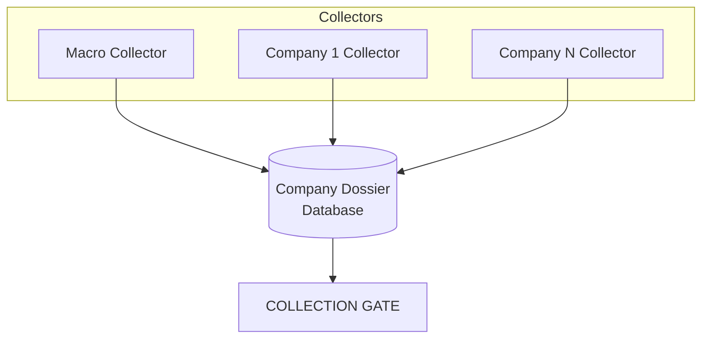
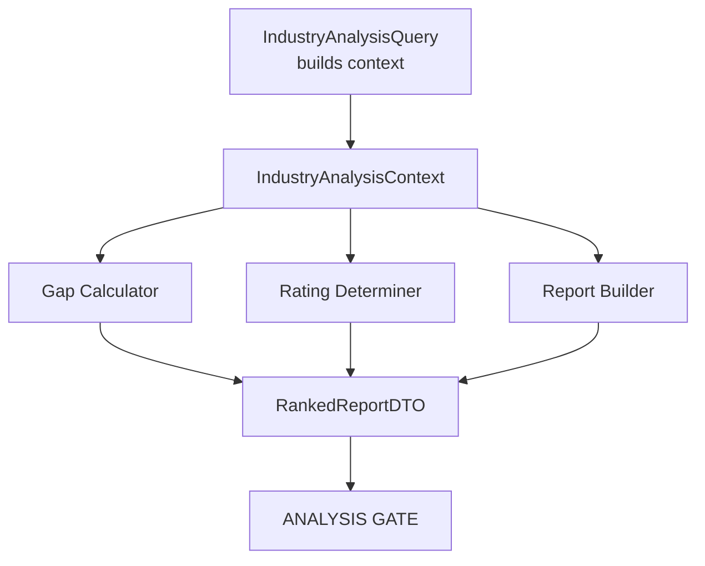
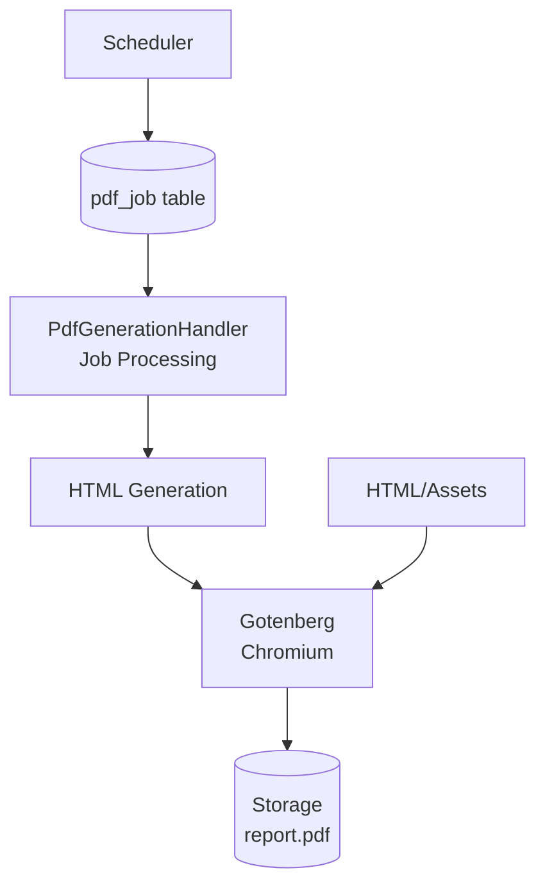
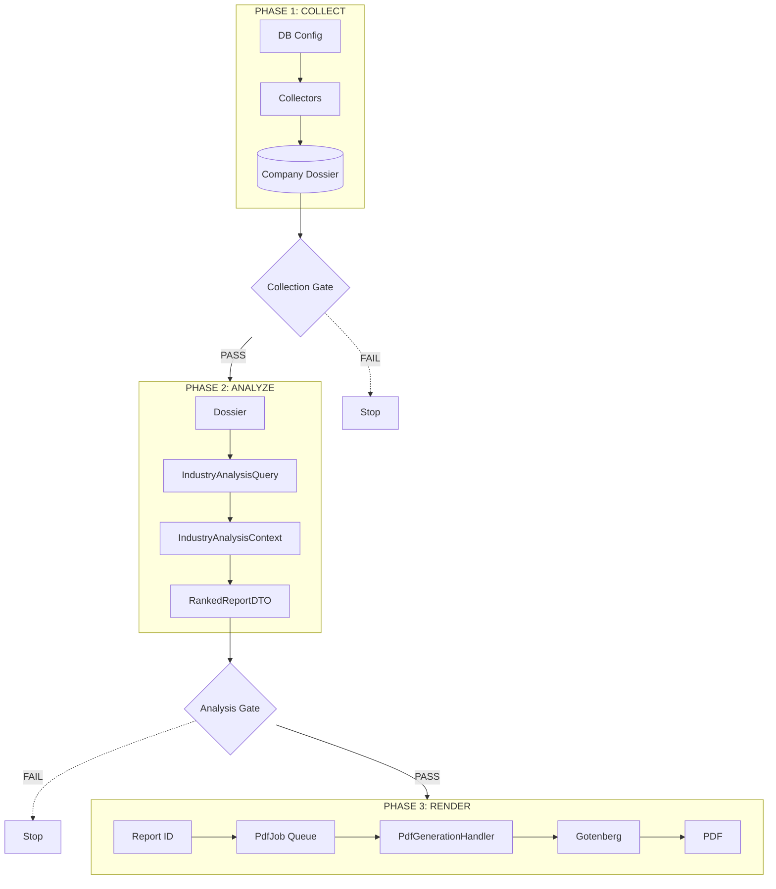

# Pipeline

The AIMM pipeline consists of three sequential phases, each with validation gates to ensure data quality.

## Phase 1: Collect

**Goal:** Gather financial data for an entire industry and populate the persistent **Company Dossier**.

| Aspect | Description |
|--------|-------------|
| Input | Industry Config (Database) |
| Output | Company Dossier (Database) |
| Collectors | Macro + Company (×N) |
| Gate | Collection Gate |

### What Gets Collected

- **Macro data**: Commodity benchmarks, margin proxies, sector indices
- **Company data** (per company):
  - Valuation metrics (market cap, P/E, EV/EBITDA)
  - Annual financials (revenue, EBITDA, net income)
  - Quarterly financials
  - Operational metrics (industry-specific)

### Collection Gate Checks

- Company collection status (fail on `failed`, warn on `partial`)
- Macro collection status (fail on `failed`, warn on `partial`)
- Missing configured companies (warn)

## Phase 2: Analyze

**Goal:** Calculate valuation gaps and determine rating based on the Company Dossier.

| Aspect | Description |
|--------|-------------|
| Input | Company Dossier (industry-wide) |
| Output | RankedReportDTO (JSON) |
| Rule | NO external calls (deterministic only) |
| Gate | Analysis Gate |

### Data Flow

1. **Query**: `IndustryAnalysisQuery` builds an `IndustryAnalysisContext` from the Dossier
2. **Factory**: `CompanyDataDossierFactory` constructs `CompanyData` DTOs for each company
3. **Analysis**: `AnalyzeReportHandler` orchestrates the sub-handlers

### Key Calculations

1. **Peer Averages**: Calculate industry averages for each metric from the context
2. **Valuation Gap**: Composite gap from fwd_pe, ev_ebitda, fcf_yield, div_yield
3. **Rating**: buy/hold/sell based on fundamentals, risk, and valuation gap

### Analysis Gate Checks

- At least 2 companies in the context
- At least 2 companies with >= 2 years of annual data and a market cap
- Data freshness warning when data is older than 30 days

## Phase 3: Render (PDF)

**Goal:** Generate a professional PDF report via an asynchronous job queue.

| Aspect | Description |
|--------|-------------|
| Input | Report ID (Database) |
| Output | report.pdf (Storage) |
| Renderer | Gotenberg (Chromium HTML-to-PDF) |
| Processing | Async Job Queue (`pdf_job` table) |

### Job Architecture

1.  **Job Creation**: A job is inserted into the `pdf_job` table.
2.  **Acquisition**: `PdfGenerationHandler` locks the job (transactional safe).
3.  **Assembly**: Data is loaded, views are rendered to HTML, and a bundle is created.
4.  **Rendering**: Gotenberg converts the HTML bundle to PDF.
5.  **Completion**: PDF is stored, and the job is marked as complete.

## Full Pipeline Diagram

